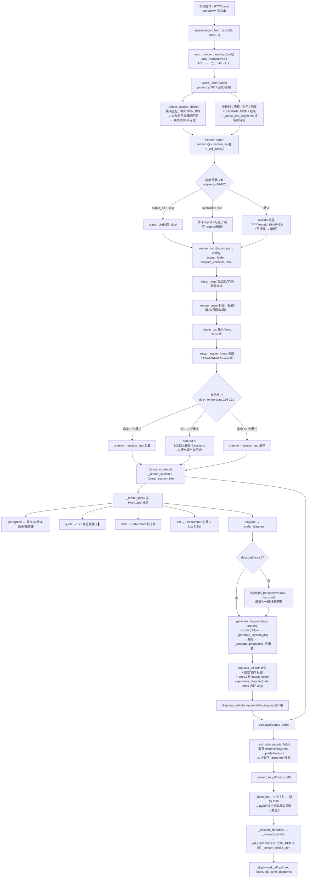
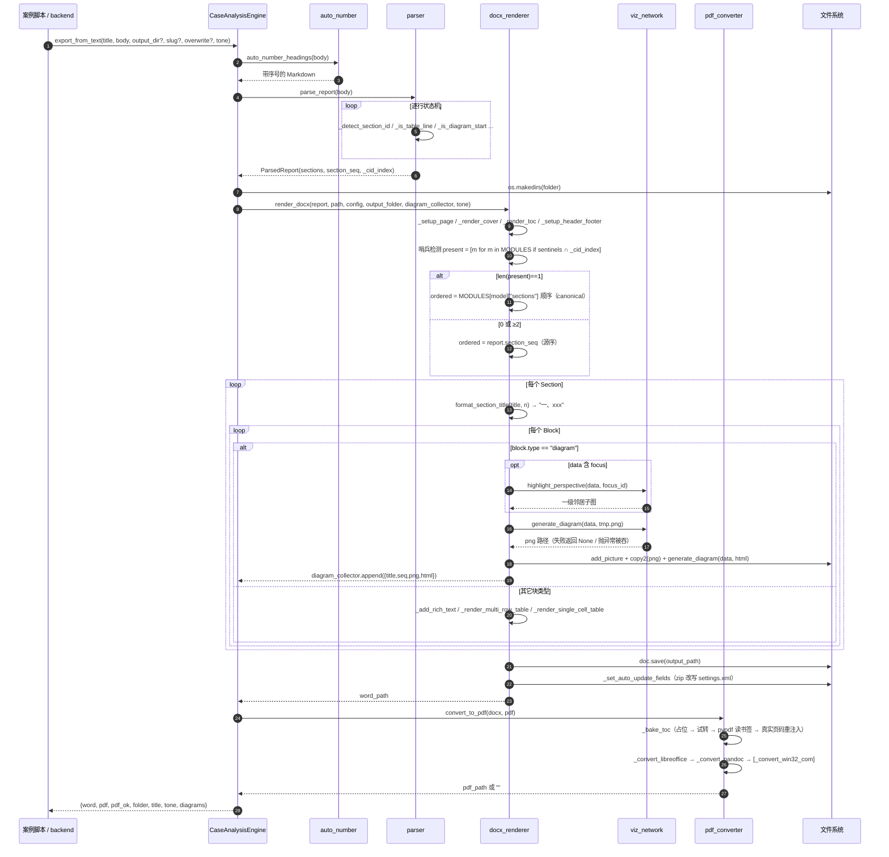
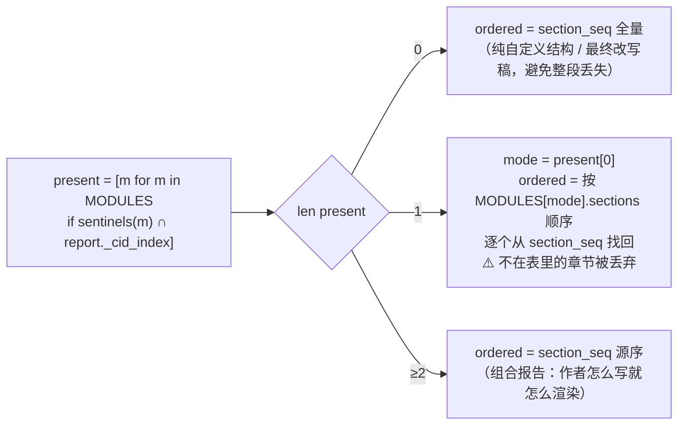
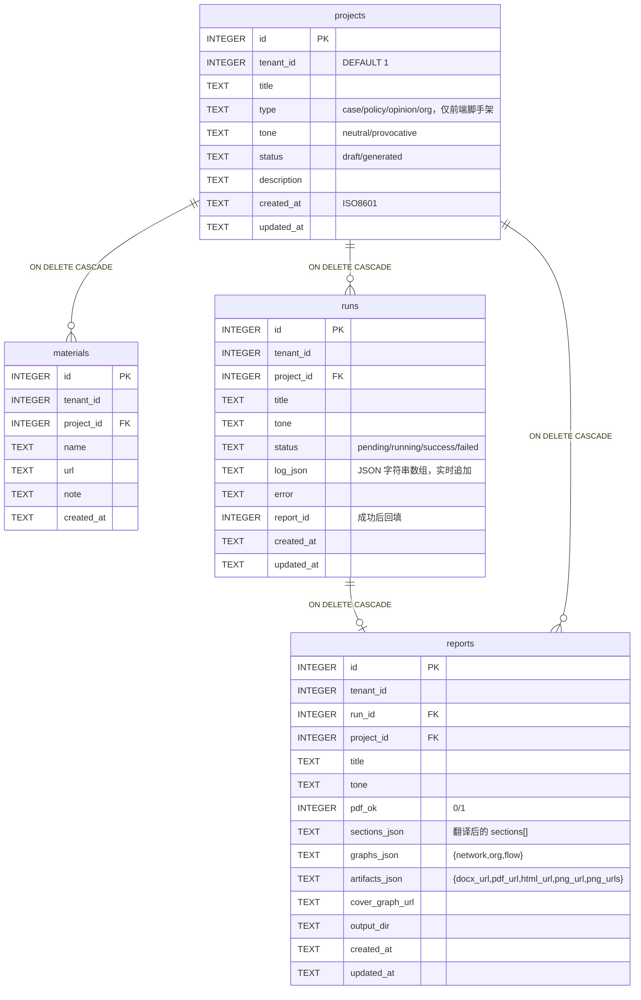
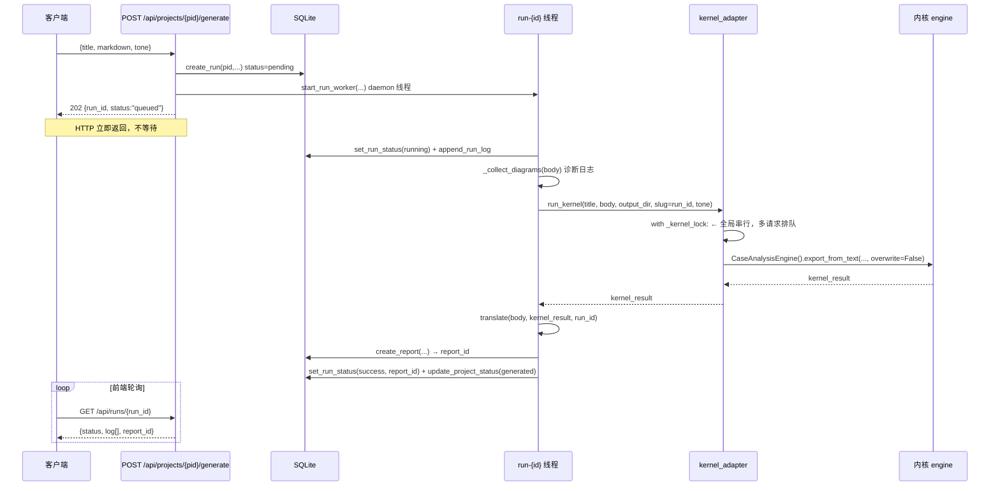
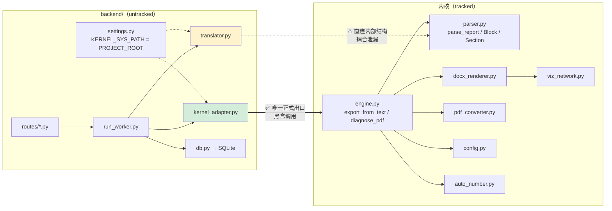
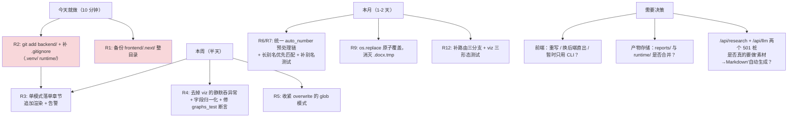

# 三元结构理论分析系统 — 架构评审报告

> 评审性质：**只读架构评审**（未修改任何项目源文件）
> 评审日期：2026-07-31
> 评审对象：`三元结构理论 分析skill脚本程序/`（内核 + backend + frontend 残留）
> 著作权：三元结构理论 © 2026 李政恒，国作登字-2026-A-00048134；代码 GNU AGPL v3

---

## 0. 五分钟速览（TL;DR）

| 维度 | 结论 |
|---|---|
| **系统本质** | 一个 **Markdown 成稿 → Word/PDF/交互式关系图** 的排版渲染流水线。**不含任何 AI/LLM 生成逻辑**——分析文字由人或外部 AI 按 `analysis_prompt.md` 写好，本系统只负责"排版 + 出图 + 章节编号 + 目录"。 |
| **内核成熟度** | ★★★★☆ 可用、稳定、已产出 13 份正式报告。7 文件约 3385 行，职责清晰，无循环依赖。 |
| **backend 成熟度** | ★★★☆☆ **MVP 已跑通闭环**（9 次 run 全部 success，产物落盘、可下载）。11 个端点、4 张表、线程池式异步。但整体 **untracked（不在 git 里）**。 |
| **frontend** | ☠️ **源码已丢失**。`frontend/` 只剩 `node_modules/`、`.next/` 构建产物和日志；`package.json`、`app/`、`src/` 全部不存在，且从未入过 git（0 tracked）。 |
| **git 状态** | 🔴 仅 1 个 commit（`204b4bc`），39 个 tracked 文件。backend 全部未入库。**这是当前最高优先级风险。** |
| **最危险的代码缺陷** | 🔴 **单模式渲染会静默丢章节**（非 canonical 章节直接不进 docx，无任何报错）；🔴 **DIAGRAM JSON 存在两套互相不兼容的字段契约**（`source/target/type` vs `from/to/relation`），后者会让出图静默失败但 run 仍报 success。 |
| **能不能跑** | ✅ 都能跑。内核：`python -m cases.run_xxx`。backend：`cd backend && .venv/Scripts/python -m uvicorn main:app --host 127.0.0.1 --port 8000`（依赖已全部装好，实测 import 通过）。前端：只能跑 `.next` 里的旧构建产物，无法改代码。 |

---

## 1. 仓库地图与代码量

### 1.1 目录结构

```
三元结构理论 分析skill脚本程序/
├── engine.py              236  ← 编排器（唯一正式出口）
├── parser.py              457  ← Markdown → 结构化数据
├── docx_renderer.py       882  ← Word 渲染 + 章节路由（核心中的核心）
├── pdf_converter.py       543  ← docx → pdf（LibreOffice/pandoc/WordCOM 三级降级）
├── viz_network.py        1031  ← 三类关系图（PNG via matplotlib / HTML via vis.js）
├── config.py              155  ← theory_config.json 加载器
├── auto_number.py          81  ← H2/H3 自动编号
├── theory_config.json           ← 理论定义 + 排版参数（禁改）
├── analysis_prompt.md    36KB   ← 写作提示词模板（运行必需）
├── AGENTS.md             12KB   ← 工作手册（信息密度最高，新人第一读物）
├── UPGRADE_PLAN.md              ← 报告质量升级方案 v1.0（2026-06-28，待实施）
├── 组合报告模式_L2设计.md         ← 源序组合设计规格 v2（已实施）
├── libs/vis-network.min.js 689KB ← 内联进 HTML，保证离线可开
├── cases/                       ← 13 个案例脚本 + _materials/ 7 个素材脚本
├── reports/                     ← 13 个已生成报告目录（.gitignore）
├── tests/test_heading_numbering.py  ← 唯一的 unittest
├── backend/                     ← FastAPI 适配层（整个 untracked）
│   ├── main.py         74   db.py      299   translator.py 235
│   ├── run_worker.py  115   kernel_adapter.py 73   settings.py 42
│   ├── routes/{projects 70, reports 86, runs 56, materials 41}
│   ├── e2e_test.py    107   graphs_test.py 147   （均为需活服务的脚本，非 pytest）
│   ├── requirements.txt（只有 fastapi + uvicorn 两行）
│   └── runtime/{app.db 68KB, projects/1..9, test_diag/, test_3diag/, test_thread/}
└── frontend/                    ← ☠️ 只剩 node_modules/ .next/ .launcher/ *.log
```

### 1.2 代码量分布

| 层 | 文件数 | 行数 | 占比 |
|---|---:|---:|---:|
| 内核 | 7 | 3385 | 71.5% |
| backend | 12 | 1246 | 26.3% |
| 测试（tests/） | 1 | ~50 | 1.1% |
| **合计（不含 cases/）** | **20** | **~4732** | 100% |

### 1.3 依赖清单

| 位置 | 依赖 | 用途 |
|---|---|---|
| `requirements.txt`（内核） | python-docx≥1.2, matplotlib≥3.10.1, networkx≥3.4.2, lxml≥5.0, Pillow≥10.0, pywin32(win) | 渲染/出图 |
| `backend/requirements.txt` | fastapi≥0.110, uvicorn[standard]≥0.27 | **不完整**——实际还需 pypdf、pydantic 及内核全部依赖 |
| 外部程序（非 pip） | **LibreOffice**（推荐）/ pandoc / MS Word+COM | PDF 转换，任一即可 |
| 实测 `.venv`（Python 3.10.11） | fastapi 0.115.13、uvicorn 0.36.0、python-docx 1.2.0、matplotlib 3.10.1、networkx 3.4.2、lxml 5.0.0、Pillow 10.0.0、pypdf 6.14.2、pydantic 2.11.7 | ✅ 全齐，可直接跑 |

---

## 2. 内核数据流：从 Markdown 到 docx/pdf/html

### 2.1 完整签名表（逐字抄自代码）

| # | 函数 | 文件:行 | 签名 |
|---|---|---|---|
| 1 | `CaseAnalysisEngine.__init__` | engine.py:33 | `def __init__(self, config: Optional[Config] = None) -> None` |
| 2 | **`export_from_text`** | engine.py:41 | `def export_from_text(self, title: str, body: str, *, output_dir: Optional[str] = None, slug: Optional[str] = None, overwrite: bool = False, tone: str = "neutral") -> dict[str, str]` |
| 3 | `export_from_parsed` | engine.py:120 | `def export_from_parsed(self, report: ParsedReport, *, output_dir=None, slug=None, overwrite=False, tone="neutral") -> dict[str, str]` |
| 4 | `auto_number_headings` | auto_number.py:34 | `def auto_number_headings(body: str) -> str` |
| 5 | `parse_report` | parser.py:260 | `def parse_report(text: str) -> ParsedReport` |
| 6 | `_detect_section_id` | parser.py:173 | `def _detect_section_id(title: str) -> str` |
| 7 | `_engine._render_docx` | engine.py:165 | `def _render_docx(self, report: ParsedReport, folder: str, tone: str = "neutral") -> str` |
| 8 | **`render_docx`** | docx_renderer.py:141 | `def render_docx(report: ParsedReport, output_path: str, config: Optional[Config] = None, output_folder: Optional[str] = None, diagram_collector: Optional[list] = None, tone: str = "neutral") -> str` |
| 9 | `_render_section` | docx_renderer.py:493 | `def _render_section(doc, section: Section, config: Config, sec_id: str, section_number: Optional[int] = None, output_folder=None, diagram_collector=None, diagram_counter=None) -> None` |
| 10 | `_render_block` | docx_renderer.py:509 | `def _render_block(doc, block: Block, config: Config, sec_id: str, output_folder=None, diagram_collector=None, diagram_counter=None) -> None` |
| 11 | `_render_diagram` | docx_renderer.py:772 | `def _render_diagram(doc, block: Block, config: Config, output_folder: Optional[str] = None, diagram_counter: Optional[list] = None) -> Optional[dict]` |
| 12 | **`generate_diagram`** | viz_network.py:62 | `def generate_diagram(data: dict, output_path: str) -> Optional[str]` |
| 13 | `highlight_perspective` | viz_network.py:977 | `def highlight_perspective(data: dict, focus_id: str) -> dict` |
| 14 | `format_section_title` | docx_renderer.py:118 | `def format_section_title(title: str, number: int) -> str` |
| 15 | `_engine._convert_to_pdf` | engine.py:180 | `def _convert_to_pdf(self, docx_path: str, folder: str) -> str` |
| 16 | **`convert_to_pdf`** | pdf_converter.py:470 | `def convert_to_pdf(docx_path: str, pdf_path: str) -> str` |
| 17 | `_bake_toc` | pdf_converter.py:321 | `def _bake_toc(docx_path: str) -> bool` |
| 18 | `diagnose_pdf` | pdf_converter.py:447 | `def diagnose_pdf() -> dict` |

**`export_from_text` 返回值形状**（engine.py:110-118）：

```python
{
    "word": "<abs path>.docx",
    "pdf":  "<abs path>.pdf"  # 失败为 ""
    "pdf_ok": bool,
    "folder": "<输出目录>",
    "title": title,
    "tone": "neutral" | "provocative",
    "diagrams": [{"title": str, "seq": int, "png": path, "html": path}, ...],
}
```

> ⚠️ 类型注解写的是 `dict[str, str]`，实际返回含 `bool` 和 `list`，注解不准确。

### 2.2 数据形态演变

| 阶段 | 数据形态 | 说明 |
|---|---|---|
| 输入 | `str`（Markdown 正文，含 `# 标题` / `## 章节` / 表格 / `> 引用` / ` ```DIAGRAM ` JSON） | 由案例脚本的 `BODY` 常量或 HTTP `markdown` 字段提供 |
| ① auto_number 后 | `str`（H2 加 `一、`、H3 加 `1.` 前缀） | **注意：此步会改变后续章节 ID 识别的匹配路径**（见 §3.3） |
| ② parse_report 后 | `ParsedReport` | 见下方数据类 |
| ③ render_docx 中 | `ordered: list[Section]` | 章节路由的产物：决定哪些段落、按什么顺序进 Word |
| ④ 逐块渲染 | python-docx `Document` 对象树 | 段落/表格/图片/域代码 |
| ⑤ diagram 分支 | `dict`（DIAGRAM JSON）→ 临时 PNG → 嵌入 Word + 复制到 output_folder + 另存 HTML | `diagram_collector` 收集 `{title, seq, png, html}` |
| ⑥ 落盘 | `.docx` | 再经 `_set_auto_update_fields` 改写 `word/settings.xml` 打开 updateFields |
| ⑦ PDF | `.pdf` | 转换前先 `_bake_toc` 把真实页码烘进 docx 目录 |

**核心数据类**（parser.py:32-66）：

```python
@dataclass
class Block:
    type: BlockType            # paragraph|quote|table|diagram|list|heading|blank|subheading
    text: str = ""
    rows: Optional[list[list[str]]] = None       # 表格
    diagram_data: Optional[dict] = None          # DIAGRAM JSON（原样）
    items: Optional[list[str]] = None            # 列表项
    level: int = 2
    sub_section_id: Optional[str] = None         # 政策子维度标识
    segments: Optional[list[tuple[str, Optional[str]]]] = None  # [(文字, url|None)]

@dataclass
class Section:
    title: str
    blocks: list[Block] = field(default_factory=list)
    cid: Optional[str] = None      # canonical id，路由的唯一依据
    mode: Optional[str] = None     # policy/event/org/opinion/None(共享)

@dataclass
class ParsedReport:
    title: str
    sections: dict[str, Section]      # 兼容视图，同 cid 时 last-wins
    section_seq: list[Section]        # 源序有序列表（组合报告的核心）
    _cid_index: set[str]              # 所有出现过的 cid，渲染器哨兵检测用
    raw_text: str = ""
    tone: str = "neutral"
```

### 2.3 流程图



### 2.4 时序图（一次完整导出）



### 2.5 DIAGRAM JSON 的正确契约（内核认这套）

```json
{
  "viz": "network | org | flow",
  "title": "图标题",
  "focus": "可选，节点 id，指定后裁剪为该主体的一级邻居子图",
  "nodes": [{"id": "A", "label": "主体A", "type": "actor"}],
  "edges": [{"source": "A", "target": "B", "label": "关系", "type": "economic"}]
}
```

| 字段 | 合法值 | 来源 |
|---|---|---|
| `viz` | `network`(默认，力导向) / `org`(自上而下树) / `flow`(自左向右，>5 节点自动蛇形折返) | viz_network.py:89-92 |
| `nodes[].type` | `material` `security` `political` `identity_culture` `institutional_future` `public` `actor` `event` | `_NODE_COLORS` viz_network.py:23 |
| `edges[].type` | `economic`(绿) `power`(红) `cultural`(紫虚线) `legal`(蓝点线) | `_EDGE_STYLES` viz_network.py:34 |
| `edges[].source/target` | **必须叫 source/target**，不是 from/to | viz_network.py:189, 477 |

---

## 3. 章节自动路由机制

### 3.1 两张表的配合

路由由两处数据表共同决定，引擎（engine.py）**完全不参与**：

**表 A：`parser._SECTION_IDS`**（parser.py:71-126）——中文标题 → canonical id，共 55 条映射（含大量别名）。

**表 B：`docx_renderer.MODULES`**（docx_renderer.py:34-65）——模式 → 章节顺序 + 哨兵集合。

| 模式 key | label | sections（canonical 渲染顺序） | sentinels（命中即判定该模式存在） |
|---|---|---|---|
| `policy` | 政策 | fact_summary, framework, policy_portrait, policy_weight, analysis_body, conclusion, appendix | policy_portrait, policy_weight |
| `event` | 事件/案例 | fact_summary, framework, case_portrait, case_flows, analysis_body, case_dynamics, conclusion, appendix | case_portrait, case_flows, case_dynamics |
| `org` | 组织 | org_portrait, org_structure, org_survival, org_reproduction, org_interest_network, org_reverse, org_transformation, conclusion, appendix | 同 sections 的前 7 项 |
| `opinion` | 舆情 | opinion_event, opinion_actors, opinion_narrative, opinion_trilife, opinion_reverse, opinion_evolution, conclusion, appendix | 同 sections 的前 6 项 |

**共享键**（`_mode_of()` 返回 `None`，parser.py:160-170）：`fact_summary` / `framework` / `analysis_body` / `conclusion` / `appendix`。前缀 `opinion_` / `org_` / `case_` / `policy_` 分别归属四模式。

### 3.2 三分支路由（docx_renderer.py:166-191）



序号由 `enumerate(ordered, start=1)` + `format_section_title()` 统一生成：先用 `_SECTION_NUMBER_PREFIX` 正则剥掉已有的中文/阿拉伯序号，再按位置补 `一、`/`二、`。所以案例脚本写不写序号都不影响成品（AGENTS.md §章节序号统一规则的实现依据）。

> 死代码：`if mode == "_base"` 分支（docx_renderer.py:194-196）永不成立——`MODULES` 里没有 `_base` 键，`mode` 只可能是 4 个模式之一或 `None`。

### 3.3 ⚠️ 路由的两个隐蔽陷阱（已实测复现）

**陷阱 1：`auto_number` 让所有标题都走"模糊匹配"路径**

`export_from_text` 先调 `auto_number_headings` 再 `parse_report`，未编号的 `## 舆情事实摘要` 变成 `## 一、舆情事实摘要`。`_detect_section_id` 的精确匹配 `title_stripped in _SECTION_IDS` 必然落空，于是进入按 dict 插入顺序的子串模糊匹配 `for keyword, sid in _SECTION_IDS.items(): if keyword in title_stripped`。**先命中先赢**，而 `事实摘要`（第 2 条）排在 `舆情事实摘要`（第 104 条）之前。

实测：

```
输入 ## 舆情事实摘要
→ engine 路径（先编号）：'一、舆情事实摘要' -> fact_summary  ❌ 应为 opinion_event
→ 直接 parse（不编号）：'舆情事实摘要'    -> opinion_event   ✅
```

后果：舆情报告若用 `舆情事实摘要` 这个别名，该段 cid 变成 `fact_summary`，而 `fact_summary` **不在** `MODULES["opinion"]["sections"]` 里 → **整段从 docx 里消失，无任何报错**。

**陷阱 2：单模式下，任何未登记的章节被静默丢弃**

实测（政策模式 + 一个自定义章节）：

```
源序: [('一、政策对象图谱','policy_portrait'), ('二、政策权重与空间分析','policy_weight'),
       ('三、背景补充说明','三_背景补充说明'), ('四、结论','conclusion'), ('五、附录','appendix')]
present modes: ['policy']
实际渲染: ['policy_portrait','policy_weight','conclusion','appendix']
被丢弃  : ['三_背景补充说明']     ← 静默消失
```

注意 slug 是 `三_背景补充说明`——**auto_number 加的序号漏进了 cid**，导致同一段落在不同位置会得到不同 cid，cid 不稳定。

`组合报告模式_L2设计.md` §2 已明确指出"混写会静默丢段——最危险"，但 v2 的修复只覆盖了**多模式**分支；**单模式分支为了"零回归"刻意保留了丢弃行为**。这是一个"已知但仍然活着"的坑。

### 3.4 新增一种报告类型要改哪几处

| # | 位置 | 改什么 | 必须？ |
|---|---|---|---|
| 1 | `parser._SECTION_IDS`（parser.py:71） | 加入新章节的中文标题 → canonical id 映射。**id 必须带唯一前缀**（如 `market_`），否则 `_mode_of()` 会把它归到 `None`（共享键） | ✅ 必须 |
| 2 | `parser._mode_of()`（parser.py:160） | 加一条 `if cid.startswith("market_"): return "market"` | ✅ 必须 |
| 3 | `docx_renderer.MODULES`（docx_renderer.py:34） | 加一项 `{"sections": [...], "sentinels": [...], "label": "..."}` | ✅ 必须 |
| 4 | `analysis_prompt.md` | 加对应段式的写作模板 | ✅ 必须（否则没人知道怎么写） |
| 5 | `AGENTS.md` §报告类型自动识别 | 更新表格 | ⭕ 规范要求 |
| 6 | `engine.py` | **不用改** | — |
| 7 | 前端/backend | **不用改**（backend 只透传 cid/mode） | — |

新增章节标题时的**避坑规则**：新别名不能包含任何已有 key 作为子串（否则被前面的 key 抢走），或者把长别名插到 `_SECTION_IDS` 更靠前的位置。

---

## 4. backend 真实完成度

### 4.1 技术栈

| 项 | 选型 |
|---|---|
| Web 框架 | FastAPI 0.115 + Pydantic v2 + Uvicorn |
| 持久化 | **stdlib `sqlite3`，无 ORM**，WAL 模式，`threading.Lock` 全局串行化写 |
| 并发模型 | **`threading.Thread(daemon=True)` 每 run 一条线程**，无队列、无进程池、无 Celery/RQ |
| 内核调用 | `sys.path.insert(0, PROJECT_ROOT)` + `from engine import CaseAnalysisEngine`（同进程 import，非子进程） |
| 鉴权 | **无**。靠绑定 `127.0.0.1` 兜底 |
| 多租户 | 字段级预留：所有表带 `tenant_id`，常量 `DEFAULT_TENANT_ID = 1` |
| 静态文件 | 自实现 `/api/files/{run_id}/{filename}` + `os.walk` 查找 + `FileResponse` |

### 4.2 路由清单（11 个业务端点，实测 `import main` 通过）

| 方法 | 路径 | 文件:行 | 作用 | 状态码 |
|---|---|---|---|---|
| GET | `/api/projects` | projects.py:34 | 列全部项目（倒序） | 200 |
| POST | `/api/projects` | projects.py:39 | 建项目（title/type/tone/description） | 201 |
| GET | `/api/projects/{pid}` | projects.py:50 | 项目详情 + 内嵌 runs 摘要列表 | 200/404 |
| GET | `/api/projects/{pid}/materials` | materials.py:29 | 列素材 | 200/404 |
| POST | `/api/projects/{pid}/materials` | materials.py:36 | 加素材（name/url/note） | 201/404 |
| POST | `/api/projects/{pid}/generate` | runs.py:17 | **核心**：建 pending run → 起后台线程 → 立即返回 `{run_id, status:"queued"}` | 202/404 |
| GET | `/api/runs/{run_id}` | runs.py:39 | 查 run 状态 + 实时 log 数组（前端轮询） | 200/404 |
| GET | `/api/reports/{report_id}` | reports.py:32 | 报告全文 sections[] + artifacts | 200/404 |
| GET | `/api/reports/{report_id}/graphs` | reports.py:40 | `{network, org, flow}` 三态图（缺失补 null） | 200/404 |
| GET | `/api/files/{run_id}/{filename:path}` | reports.py:77 | 下载 docx/pdf/png/html | 200/400/404 |
| GET | `/api/health` | main.py:41 | `{"status":"ok"}` | 200 |
| GET | `/` | main.py:45 | 服务元信息 | 200 |
| POST | `/api/research` | main.py:50 | **留桩**，恒 501 | 501 |
| POST | `/api/llm` | main.py:54 | **留桩**，恒 501 | 501 |

**没有任何 DELETE / PUT / PATCH**——项目、素材、报告一旦创建不可删改。

### 4.3 数据库 Schema（`backend/runtime/app.db`，4 表 + 4 索引）



索引：`idx_runs_project`、`idx_runs_report`、`idx_materials_project`、`idx_reports_run`。
**注意：`runs.project_id` 有 FK 但 `projects.type` 不落到内核**——内核靠章节哨兵自路由，`type` 纯粹是前端写作脚手架。

**当前库中数据**：9 个 project / 9 个 run（全部 success）/ 9 个 report，均为 `端到端测试报告` ×3 和 `三态图测试` ×6，即两个自检脚本的产物。无真实业务数据。

### 4.4 `translator.py` 与 `kernel_adapter.py` 各干什么（假设已证实）

**结论：team-lead 的假设基本成立，但需要修正一处。**

| 模块 | 实际职责 | 你的假设 | 判定 |
|---|---|---|---|
| `kernel_adapter.py` | ✅ **内核黑盒调用层**。`_ensure_sys_path()` 注入项目根；`_kernel_lock`（全局 `threading.Lock`）串行化内核调用（注释明说"内核非线程安全，matplotlib/docx 共享状态"）；每次 `CaseAnalysisEngine()` 新建实例避免 `_diagrams` 状态串台；只调 `export_from_text` 和 `diagnose_pdf`。**73 行，无任何内核逻辑复制** | 正确 | ✅ 证实 |
| `translator.py` | ⚠️ **不是"素材→Markdown"层，而是"内核结构 → 前端 JSON 契约"的下行翻译层**。它把 `parser.Block/Section` 序列化成前端能吃的 dict，把 DIAGRAM 按 `viz` 分成三态图，从附录提 evidence 挂到节点上，把内核产物的本地路径转成 `http://127.0.0.1:8000/api/files/{run_id}/{filename}` 绝对 URL | 方向反了 | ⚠️ 修正 |

**系统里没有任何"素材 → Markdown"的自动生成层。** `materials` 表只是一张 URL 备忘清单，与 `generate` 端点完全解耦；正文 `markdown` 必须由调用方（前端编辑器 / 人 / 外部 AI）整段提供。`/api/research` 和 `/api/llm` 两个 501 留桩就是这个缺口的占位。

`translator.py` 四个职责（对应文件里的 4 个小节）：

| 节 | 函数 | 产出 |
|---|---|---|
| 1 | `build_sections(body) -> list[dict]` | 按 `section_seq` 顺序输出 `{order, title, cid, mode, blocks[]}`，过滤 blank 块 |
| 2 | `build_graphs(body, appendix_evidence) -> dict` | 按 `diagram_data.viz` 分组，**同类多图只取第一张（MVP 限制）**，无 DIAGRAM 时三个键全 null |
| 3 | `extract_appendix_evidence(body) -> list[dict]` / `_attach_evidence(node, evidence)` | 从附录 `[名称](url)` 提 `{claim, source_url}`，按 label/id 与 claim **互相包含**（宽松匹配）挂到节点 |
| 4 | `build_artifacts(kernel_result, run_id) -> tuple[dict, Optional[str]]` | 路径 → 绝对 URL，`cover_graph_url = png_urls[0]` |
| 入口 | `translate(body, kernel_result, run_id) -> dict` | 汇总上述四项 |

### 4.5 `run_worker.py` 的任务模型

**答：异步，但不是队列——是"每请求一条 daemon 线程 + 全局内核锁串行"。**



特性与局限：

| 维度 | 现状 |
|---|---|
| 状态机 | `pending → running → success / failed`（异常全部在线程内吞掉，写 `failed` + `error` + traceback 进 log） |
| 并发度 | **实际串行 = 1**（`kernel_adapter._kernel_lock` 全局锁），线程只是让 HTTP 不阻塞 |
| 持久性 | ❌ **进程重启 = 任务丢失**，`running` 状态的 run 永远卡住，无重试无补偿 |
| 取消 | ❌ 无 |
| 进度 | 只有文本 log 追加，无百分比；前端靠轮询 `GET /runs/{id}` |
| 产物目录 | `runtime/projects/{pid}/runs/{rid}/{safe_title}_{rid}/` |
| 调试噪声 | run_worker.py:35-43、61-73 有一大段标着 `# DEBUG:` 的日志代码（parser 诊断、diagram 明细、目录文件清单），应为临时排障产物 |

### 4.6 自检脚本覆盖了什么

两个都是**独立可执行脚本**（`raise SystemExit(1)` 退出），**不是 pytest 用例**，且**必须先手动启动服务**（硬编码 `BASE = "http://127.0.0.1:8000"`）。

| 脚本 | 覆盖 | 未覆盖 |
|---|---|---|
| `e2e_test.py`（107 行，9 步） | 建项目 → 加素材 → 列素材 → generate → 轮询 90s → 取报告 → 取 graphs → 查项目状态 → 下载 docx（含中文文件名 URL 编码）。正文是极简两段 Markdown | 报错分支、并发、DIAGRAM |
| `graphs_test.py`（147 行） | 带 3 个 DIAGRAM 块（network/org/flow）的正文，验证三态图分类、evidence 挂载、PNG 下载 | 见下方致命问题 |
| `tests/test_heading_numbering.py`（唯一 unittest） | `format_section_title` 的 4 组断言 + 一次真实 `render_docx` 验证 `三元结构分析正文` 有序号 | 其它一切 |

🔴 **`graphs_test.py` 自己就是错的**：它写的 DIAGRAM JSON 用 `{"from","to","relation","group"}`，而内核要求 `{"source","target","type","type"}`。实测数据库 run #9 日志：

```
正文长度=1012 DIAGRAM块数=3
内核完成：word=三态图测试.docx, pdf_ok=True, diagrams=0     ← 3 个块，0 张图
  file: 三态图测试.docx / .docx.tmp / .pdf                   ← 无任何 png/html
```

原因链：`_generate_png` 里 `G.add_edge(e["source"], e["target"])` 抛 `KeyError('source')` → 被 `docx_renderer.py:864` 的 `except Exception: pass` 吞掉 → `diag_result = None` → `diagrams=[]` → Word 里无图、`artifacts.png_urls=[]` → **但 run 状态仍然是 `success`，脚本最后照样打印 `GRAPHS_TEST: PASS`**（因为它没断言 `png_urls` 非空）。

也就是说：**这个"通过"的测试实际上在掩盖一个 P0 级的静默失败。**

### 4.7 能不能跑起来 / 启动命令

✅ 能。实测 `import main` 成功、18 条路由全部注册、`.venv` 依赖齐全、`app.db` 里有 9 次成功记录、`.venv-uvicorn.log` 有完整的 HTTP 访问日志。

启动命令（`main.py` docstring 第 4-6 行）：

```bash
cd backend
.venv/Scripts/python -m uvicorn main:app --host 127.0.0.1 --port 8000 --reload
```

或 `python main.py`（走 `uvicorn.run(host=HOST, port=PORT, reload=False)`）。

> 前端无法启动（源码丢失）。可用 `http://127.0.0.1:8000/docs` 的 Swagger UI 手动调 API 验证后端。

---

## 5. 内核 ↔ backend 耦合点审计

### 5.1 全量导入扫描结果

对 `backend/**/*.py` 做 `^(from|import)\s+(engine|parser|docx_renderer|viz_network|pdf_converter|config|auto_number)` 扫描，**只有 2 处**：

| 位置 | 语句 | 判定 |
|---|---|---|
| `kernel_adapter.py:51` | `from engine import CaseAnalysisEngine`（函数内延迟导入） | ✅ 合规，唯一正式出口 |
| `kernel_adapter.py:72` | `from engine import diagnose_pdf as _diag` | ✅ 合规，只读诊断 |
| `translator.py:20` | `from parser import parse_report, ParsedReport, Section, Block` | ⚠️ 直接依赖内核内部数据结构 |

**结论：**

- ✅ **没有绕过 `export_from_text` 生成报告**——backend 从未直接调 `render_docx` / `generate_diagram` / `convert_to_pdf`。
- ✅ **没有复制粘贴内核逻辑**——没有第二份 Markdown 解析器、没有第二份章节顺序表、没有第二份图布局算法。
- ⚠️ **但存在一个"半黑盒"泄漏**：`translator.py` 直连 `parser`，意味着 backend 与内核的耦合面不止 `export_from_text` 一个函数，还包括 `Block` / `Section` / `ParsedReport` 三个 dataclass 的字段名。内核改这些字段名会直接打断 backend。

### 5.2 耦合面全景



### 5.3 三处"同一件事做两遍"的重复计算

| 问题 | 位置 | 影响 |
|---|---|---|
| **同一份正文被 parse 4 次** | `translate()` 调 `extract_appendix_evidence`(parse#1) + `build_sections`(parse#2) + `build_graphs`→`_collect_diagrams`(parse#3)，再加 `engine.export_from_text` 内部的 parse#4 | 纯浪费。translator 的 docstring 写着"一次解析，多处复用"，**与实现不符** |
| 🔴 **translator 与 engine 的章节路由结果可能不一致** | `engine` 先 `auto_number_headings` 再 parse；`translator` **直接** parse 原始 body。实测：`## 舆情事实摘要` → engine 得 `fact_summary`，translator 得 `opinion_event` | **同一份报告，Word 里的章节和 Web 里的章节 cid/title 不一样**；Word 会丢段而 Web 不会，或反之 |
| 章节标题不一致 | Word 里是 `一、舆情事实摘要`（渲染器补号），Web `sections[].title` 是 `舆情事实摘要`（未编号） | 前端要自己补序号才能与 Word 对齐 |

实测证据：

```
translator视角: [('舆情事实摘要', 'opinion_event'), ('结论', 'conclusion')]
engine视角    : [('一、舆情事实摘要', 'fact_summary'), ('二、结论', 'conclusion')]
```

---

## 6. 风险与技术债清单（按严重度排序）

### 🔴 P0 — 会丢数据 / 丢工作成果

| # | 问题 | 位置 | 影响 | 建议动作 |
|---|---|---|---|---|
| **R1** | **frontend 源码已丢失**。`frontend/` 只剩 `node_modules/`、`.next/`（BUILD_ID `pYMI59pkgj92cqdhITm2a`、Next.js 15.5.22）、`.launcher/` 和日志；`package.json`、`app/`、`src/`、`tsconfig.json` 全部不存在。且 `.gitignore` 只忽略了 `frontend/node_modules|.npm-cache|.next|out|coverage`——**源码本可入库，但从未 commit 过（0 tracked）** | `frontend/` | 18 条路由的整个 Web UI 无法维护、无法修改、无法重建。只能跑旧的静态构建产物 | ①**立刻备份 `.next/` 整个目录**（含 `server/app/*.html`、`static/chunks/*.js`，是唯一残存证据）；②从 `.next/app-path-routes-manifest.json` 抄出路由清单作为重写的需求基线（见下表）；③决策：重写前端 or 改用后端直出模板页；④**新前端第一件事就是 `git add`** |
| **R2** | **backend/ 整个未入 git**。仓库仅 1 个 commit（`204b4bc`），39 个 tracked 文件，全是内核 + cases + 文档。`backend/*.py`（1246 行）、`backend/routes/`、`backend/requirements.txt` 全部 untracked | 仓库根 | 一次误删/误清理 = 1246 行工作量归零，且没有任何历史可回溯。R1 已经在这个仓库里发生过一次了 | **今天就做**：在 `.gitignore` 里加 `backend/.venv/`、`backend/runtime/`，然后 `git add backend/ && git commit`。这是本报告里唯一一条"立刻、无需讨论"的行动 |
| **R3** | **单模式渲染静默丢章节**。`present` 只命中 1 个模式时，`ordered` 只取 `MODULES[mode]["sections"]` 列表里的 cid，其余章节直接不进 Word，无警告无日志 | `docx_renderer.py:174-188` | 作者写了 10 段，成品只有 7 段，且**看起来完全正常**（序号连续、目录完整）。`组合报告模式_L2设计.md` §2 已把这个定性为"最危险" | 单模式分支末尾加"落单章节检测"：`dropped = [s for s in section_seq if s.cid not in base]`，非空时 **①追加到 ordered 尾部** 或 **②至少 `warnings.warn` 出来**。推荐 ①+②ded |
| **R4** | **DIAGRAM JSON 存在两套不兼容契约**。内核认 `source/target/type`；`backend/graphs_test.py` 和（推测）已丢失的前端认 `from/to/relation/group`。后者进内核 → `KeyError('source')` → 被 `docx_renderer.py:864` 的 `except Exception: pass` 吞掉 → 无图、无报错、run 仍 `success` | `viz_network.py:189,477` vs `backend/graphs_test.py:36-78`；吞异常在 `docx_renderer.py:860-865` | 用户点"生成"，拿到一份**没有任何关系图的报告**，界面显示成功。数据库 run#4~#9 六次全部命中此坑（`diagrams=0`） | ①**把 `except Exception: pass` 改成记录到 `diagram_collector` 的错误列表并 `warnings.warn`**；②在 `viz_network` 入口加字段归一化（同时接受 `from/to`→`source/target`、`relation`→`type`）；③修正 `graphs_test.py` 的样例数据并**加上 `assert png_urls` 断言** |
| **R5** | **`overwrite=True` 的 glob 删除可能误删同前缀报告**。`glob(reports/{safe_name}_*)` + `shutil.rmtree` | `engine.py:93-98`、`142-144` | 现有 `reports/` 里已有 `从饭圈到性别动员_一种平台...` 和 `从饭圈到性别动员_知乎回答...` 两个目录。若某次以 `从饭圈到性别动员` 为标题跑 `overwrite=True`，**两个历史报告目录会被一起 rmtree** | 把 glob 模式收紧为 `{safe_name}_20[0-9][0-9][0-1][0-9][0-3][0-9]_[0-9]*`（只匹配时间戳后缀），或改为先读目录名再用正则校验 |

### 🟠 P1 — 会出错但可恢复

| # | 问题 | 位置 | 影响 | 建议动作 |
|---|---|---|---|---|
| **R6** | **章节别名模糊匹配按 dict 顺序"先命中先赢"**，且 `auto_number` 保证了精确匹配必然落空。实测 `舆情事实摘要` → `fact_summary`（错），叠加 R3 后整段消失 | `parser.py:173-184`（`_detect_section_id`）+ `engine.py:73-74` 的调用顺序 | 别名越加越多，误路由概率单调上升。目前 `_SECTION_IDS` 有 55 条 | ①`_detect_section_id` 里先剥掉序号前缀（复用 `docx_renderer._SECTION_NUMBER_PREFIX`）再做精确匹配；②模糊匹配改为**按 key 长度降序**遍历（长别名优先）；③加一个覆盖全部 55 条别名的单元测试 |
| **R7** | **translator 与 engine 路由结果可能分叉**（§5.3）。Web 视图与 Word 成品对不上 | `translator.py:71,86,135` 未调 `auto_number_headings` | 同一 report_id 的 `sections[].cid` 与 Word 章节不一致，前端做任何基于 cid 的高亮/跳转都会错位 | 让 translator 与 engine 走**同一条预处理链**：`parse_report(auto_number_headings(body))`。更彻底的做法是让 `export_from_text` 把 `ParsedReport` 也返回出来，translator 直接复用（顺带解决 4 次重复 parse） |
| **R8** | **异步任务无持久化、无重试**。进程重启后 `running` 状态的 run 永久卡死 | `run_worker.py:105-115` | 本地单机场景影响有限，但 UI 会显示一个永远转圈的任务 | 启动时把所有 `running` 状态的 run 标为 `failed`（"服务重启中断"）；或引入最简单的 DB 轮询队列 |
| **R9** | **每份 docx 旁残留 `.docx.tmp`**。`_set_auto_update_fields` 用 `shutil.move` 覆盖，Windows/沙箱下降级为 `copyfile + unlink`，unlink 被安全策略拦截 | `docx_renderer.py:211-251`；日志 `backend/.venv-uvicorn.log` 有 `SAFE_DELETE_FAIL_CLOSED` | 每份报告目录多一个 ~40KB 垃圾文件，且会被 `os.walk` 文件下载端点扫到 | 改为写 `tempfile` 到系统临时目录再 `os.replace()`（原子覆盖，不需要 unlink）；或至少把 `.tmp` 从下载端点过滤掉 |
| **R10** | **`export_from_text` 默认模式（`overwrite=False`、无 `output_dir`）每跑一次新建时间戳目录且从不清理** | `engine.py:101` | `reports/` 无限膨胀。当前已有 13 个目录，其中 `方星海被查事件_..._20260728_005158` 就是时间戳残留 | AGENTS.md 已规定"正式交付用 `overwrite=True`"，但这是**约定而非默认**。建议把默认改为 `overwrite=True`，或加一个 `keep_last_n` 参数 |
| **R11** | **PDF 转换失败只发 `warnings.warn`，`pdf_ok=False` 后流程继续** | `engine.py:191-195` | 没装 LibreOffice 的机器会静默只出 Word，用户可能到很后面才发现 | 服务启动时调 `diagnose_pdf()` 并在 `/api/health` 里暴露结果；前端/CLI 显式提示 |

### 🟡 P2 — 质量与可维护性

| # | 问题 | 位置 | 影响 | 建议动作 |
|---|---|---|---|---|
| **R12** | **测试覆盖率近乎为零**。3385 行内核只有 1 个测试文件（4 个用例，全在测章节编号）；backend 的两个"测试"是需活服务的脚本，且其中一个（R4）在掩盖 bug | `tests/`、`backend/*_test.py` | 任何重构都是盲改 | 优先补：①`_detect_section_id` 全别名表；②三分支路由（0/1/≥2 模式）各一例；③`viz_network` 三种 viz 的最小可跑数据；④把 backend 脚本改造成 `pytest` + `TestClient`（无需起服务） |
| **R13** | **`highlight_perspective` 的视觉降级只实现了 1/3**。`_opacity` 只在 `_generate_png` 生效（viz_network.py:178-186），`_generate_layered_png`（走 `_get_node_color`）和 `_generate_html` 都无视它 | viz_network.py:598, 836 | org/flow 图和交互式 HTML 的 focus 视角看不出焦点，与 network PNG 表现不一致 | 要么三处统一实现，要么明确文档化"focus 仅支持 network PNG" |
| **R14** | **backend/requirements.txt 严重不完整**，只有 fastapi + uvicorn 两行，缺 pypdf、pydantic 及全部内核依赖 | `backend/requirements.txt` | 新机器按它装完起不来 | 补全，或写 `-r ../requirements.txt` |
| **R15** | **evidence 匹配规则过于宽松**：`label in claim or claim in label`（双向包含，小写） | `translator.py:169-171` | 单字/双字节点标签（如"国""平台"）会匹配到大量无关来源 | 加最小长度阈值（≥2 或 ≥3 字），或改为分词/精确匹配 |
| **R16** | **未识别章节的 cid 不稳定**：slug 由**带序号的完整标题**生成，得到 `三_背景补充说明`；同一段落挪个位置 cid 就变 | `parser.py:183-184` | 前端/DB 里存的 cid 不可作为稳定键 | slug 化前先剥序号前缀 |
| **R17** | **run_worker 里残留大段 `# DEBUG:` 日志代码**（parser 诊断、diagram 明细、目录 listing） | `run_worker.py:35-43, 61-73` | log 数组噪声大，每条都要写一次 DB（`append_run_log` 是"读全量 JSON → append → 写回"，O(n²)） | 收敛为 log level 控制；`append_run_log` 改为独立 `run_logs` 表按行 insert |
| **R18** | **`@app.on_event("startup")` 在 FastAPI 0.115 已废弃** | `main.py:64` | 未来升级会失效 | 改用 `lifespan` |
| **R19** | 死代码与小瑕疵：`docx_renderer.py:194` 的 `if mode == "_base"` 永不成立；`viz_network.py:169-186` 的 `node_colors` 列表构建后从未使用；`parser.py:26/29` 定义了两个完全相同的 `_LINK_PATTERN`/`_RE_LINK`；`export_from_text` 返回类型注解 `dict[str,str]` 与实际不符 | 各处 | 阅读干扰 | 清理 |
| **R20** | **无鉴权、无速率限制**，任何本机进程都能读写全部数据 | `main.py` | 本地优先设计下可接受（已绑 127.0.0.1），但 `PUBLIC_BASE_URL` 可被环境变量改成对外地址 | 若将来外网暴露，必须补 token |
| **R21** | **DB 无迁移机制**，`init_db()` 只有 `CREATE TABLE IF NOT EXISTS` | `db.py:49` | 改 schema 只能删库重建 | 加一张 `schema_version` 表 + 顺序迁移脚本 |
| **R22** | **`_find_run_file` 每次下载都 `os.walk` 全部 project 目录** | `reports.py:60-74` | 报告变多后下载变慢 | 直接用 `reports.output_dir` 字段拼路径 |
| **R23** | `reports/` 与 `backend/runtime/` 是**两套独立的产物存储**，互不知晓 | — | 同一份报告可能在两处各存一份，磁盘翻倍 | 统一到一处，或明确文档化"CLI 走 reports/、Web 走 runtime/" |

---

## 7. 给新接手者的上手指引

### 7.1 阅读顺序（约 40 分钟）

```
1. AGENTS.md                  ← 项目宪法，10 分钟，尤其看"报告类型自动识别"和"工作规范"
2. 本报告 §2 + §3             ← 数据流与路由，10 分钟
3. cases/run_report.py        ← 输入长什么样，5 分钟
4. engine.py（236 行）         ← 全文，5 分钟
5. docx_renderer.py:141-208   ← render_docx 主入口 + 路由三分支，5 分钟
6. 组合报告模式_L2设计.md      ← 为什么路由是现在这样，5 分钟
（要动 Web 才读）backend/run_worker.py + kernel_adapter.py + translator.py
```

### 7.2 跑一个案例报告（CLI，最快验证路径）

```bash
cd "D:/360MoveData/Users/马格斯佩斯科夫/Desktop/理论/三元结构理论/程序/三元结构理论 分析skill脚本程序"

# 0) 先确认 PDF 转换器可用（否则只出 Word）
backend/.venv/Scripts/python.exe -c "from pdf_converter import diagnose_pdf; print(diagnose_pdf())"
#    若 libreoffice=False：装 LibreOffice，或 set LIBREOFFICE_PATH=C:\Program Files\LibreOffice\program

# 1) 跑一个现成案例（在项目根目录用模块方式运行）
backend/.venv/Scripts/python.exe -m cases.run_public_opinion_demo
#    产物：reports/示例_一场平台算法限流争议的舆情七段式拆解/{*.docx, *.pdf, 图N_*.png/.html}

# 2) 新建自己的案例
cp cases/run_report.py cases/run_my_case.py
#    改 TITLE 和 BODY 两个常量；BODY 用 ## 章节名，章节名必须命中 parser._SECTION_IDS
backend/.venv/Scripts/python.exe -m cases.run_my_case

# 3) 跑唯一的单元测试
backend/.venv/Scripts/python.exe -m unittest tests.test_heading_numbering -v
```

> ⚠️ 正式交付时在脚本里写 `engine.export_from_text(TITLE, BODY, overwrite=True)`，避免 `reports/` 堆积（AGENTS.md 明文规定）。

### 7.3 起 backend

```bash
cd backend
.venv/Scripts/python -m uvicorn main:app --host 127.0.0.1 --port 8000 --reload

# 验证
curl http://127.0.0.1:8000/api/health          # {"status":"ok"}
# 浏览器打开 http://127.0.0.1:8000/docs         # Swagger UI，可手动调全部 11 个端点

# 端到端自检（需服务已启动，另开一个终端）
cd backend && .venv/Scripts/python e2e_test.py
# graphs_test.py 慎用：它的 DIAGRAM 样例数据字段名是错的（见 R4），会造成"通过但无图"
```

前端无法启动。要看 Web UI，只能：`cd frontend && npx next start`（用残留的 `.next` 产物，Next.js 15.5.22 在 `node_modules` 里），但**任何代码修改都不可能**。

### 7.4 改代码红线

| # | 红线 | 原因 |
|---|---|---|
| 1 | ❌ **不要绕过 `engine.export_from_text()` 出报告** | AGENTS.md 明文；历史上发生过"胖猫/甲酰胺绕过事件"，导致报告要靠 docx 反推补回 |
| 2 | ❌ **不要修改 `theory_config.json`** | 理论定义 + 排版参数的真源，改动影响全部历史报告的一致性 |
| 3 | ❌ **不要在 backend 里重写 parser / renderer / viz** | 目前耦合面干净（只有 `kernel_adapter` + `translator→parser` 两处），别把它污染了 |
| 4 | ❌ **不要新起一个案例脚本模板** | 复制 `cases/run_report.py` |
| 5 | ⚠️ **改 `parser._SECTION_IDS` 必须同步改 `docx_renderer.MODULES` + `parser._mode_of` + `analysis_prompt.md`**（§3.4） | 漏改任何一处 = 章节静默消失 |
| 6 | ⚠️ **新增章节别名前，检查它是否包含任何已有 key 作为子串**（§3.3 陷阱 1） | 会被前面的 key 抢走路由 |
| 7 | ⚠️ **改 `parser.Block/Section/ParsedReport` 的字段名会打断 `backend/translator.py`** | 唯一的耦合泄漏点 |
| 8 | ⚠️ **DIAGRAM JSON 一律用 `source`/`target`/`type`**，不要用 `from`/`to`/`relation` | 后者会静默丢图（R4） |
| 9 | ✅ **动任何 backend 代码前，先 `git add backend/` 提交一次基线** | R2 |
| 10 | ✅ 案例脚本是一次性产物，用完即弃；报告在 `reports/` 持久保留；新增案例后更新 `AGENTS.md` 清单 | AGENTS.md 规范 |

### 7.5 已丢失前端的路由基线（供重写参考）

从 `.next/app-path-routes-manifest.json` 提取，共 18 条（Next.js App Router）：

| 路由 | 推测职责 |
|---|---|
| `/` | 首页 |
| `/dashboard` | 总览 |
| `/projects` `/projects/new` `/projects/[id]` | 项目列表 / 新建 / 详情 |
| `/projects/[id]/input` | **正文 Markdown 编辑器**（对应 `POST /generate`） |
| `/projects/[id]/manage` | 项目管理（对应 `GET /projects/{pid}` 内嵌 runs） |
| `/materials` | 素材库（对应 `/materials` 端点） |
| `/runs/[runId]` | 运行进度页（轮询 `GET /runs/{id}`） |
| `/reports` `/reports/[reportId]` | 报告列表 / 阅读（`GET /reports/{id}`） |
| `/reports/[reportId]/network` | 关系图页（`GET /reports/{id}/graphs`） |
| `/analysis` `/analysis/[projectId]` | 分析视图 |
| `/interest-analysis` `/interest-analysis/[reportId]` | 利益分析视图 |
| `/settings` | 设置 |
| `/_not-found` | 404 |

> 注意：`/reports` 和 `/interest-analysis`（无参数版）在后端**没有对应端点**——后端只有 `GET /reports/{id}`，没有 `GET /reports` 列表接口。重写前端时需要补这个端点。

---

## 8. 修复优先级建议（给决策者的一页纸）



---

## 附录 A：关键文件速查

| 我想改… | 去这里 |
|---|---|
| 加一种报告类型 / 加章节别名 | `parser.py:71` `_SECTION_IDS` + `parser.py:160` `_mode_of` + `docx_renderer.py:34` `MODULES` + `analysis_prompt.md` |
| 章节渲染顺序 | `docx_renderer.py:34` `MODULES[m]["sections"]` |
| 章节序号格式（一、二、） | `docx_renderer.py:93` `_chinese_number` / `:118` `format_section_title` |
| 字体 / 字号 / 颜色 / 页边距 | `theory_config.json` 的 `typography` 段（**改前确认是否真的要动**） |
| 引用块 / 结论箭头的样式 | `docx_renderer.py:607` `_render_single_cell_table` + 颜色常量 `:78-85` |
| 关系图配色 / 边样式 | `viz_network.py:23` `_NODE_COLORS` / `:34` `_EDGE_STYLES` |
| 图布局算法 | `viz_network.py:148` `_generate_png`(network) / `:448` `_generate_layered_png`(org,flow) / `:395` `_layered_positions` / `:347` `_snake_positions` |
| 交互式 HTML 模板 | `viz_network.py:663` `_HTML_VIS_TEMPLATE` |
| PDF 目录页码 | `pdf_converter.py:321` `_bake_toc` / `:157` `_measure_heading_pages` |
| 输出目录命名 | `engine.py:86-102` |
| API 端点 | `backend/routes/*.py` |
| 前端 JSON 契约 | `backend/translator.py` |
| 数据库表 | `backend/db.py:49` `init_db` |

## 附录 B：本次评审的验证手段

| 结论 | 验证方式 |
|---|---|
| backend 可启动、18 条路由 | `python -c "import main; ..."` 实际导入并遍历 `app.routes` |
| 依赖齐全 | 在 `backend/.venv` 中逐个 `importlib.import_module` |
| 9 次 run 全 success、diagrams=0 | 直接查询 `backend/runtime/app.db` 的 `runs` 表与 `log_json` |
| `graphs_test` 出图失败 | 对照 `runtime/projects/9/.../` 目录只有 docx/pdf 无 png |
| 别名模糊匹配误路由 | 实跑 `parse_report(auto_number_headings("## 舆情事实摘要"))` |
| 单模式丢章节 | 实跑路由逻辑，输出"被丢弃: ['三_背景补充说明']" |
| translator/engine 路由分叉 | 对同一 body 分别走两条预处理链 parse 并对比 cid |
| 前端源码丢失 + 18 条路由 | `ls frontend/`、读 `.next/app-path-routes-manifest.json` |
| git 状态 | `git log --oneline`、`git ls-files` |

---

*报告完 — 本次评审未修改任何项目源文件，唯一写入为本文档。*
