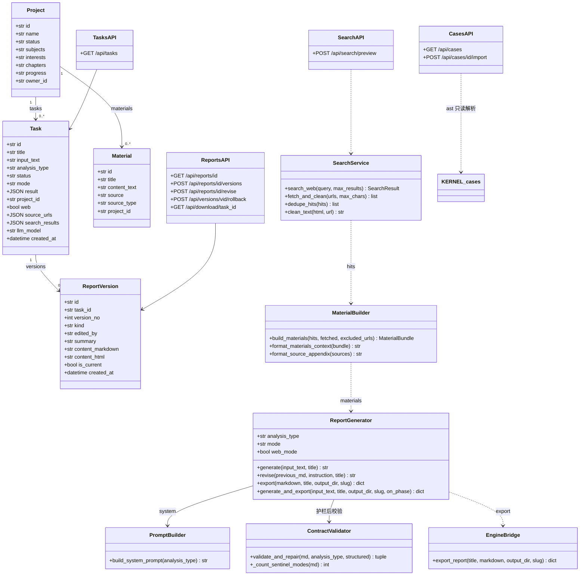
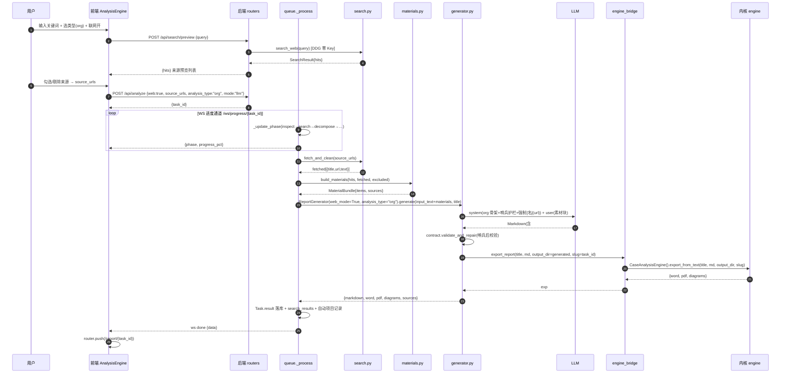
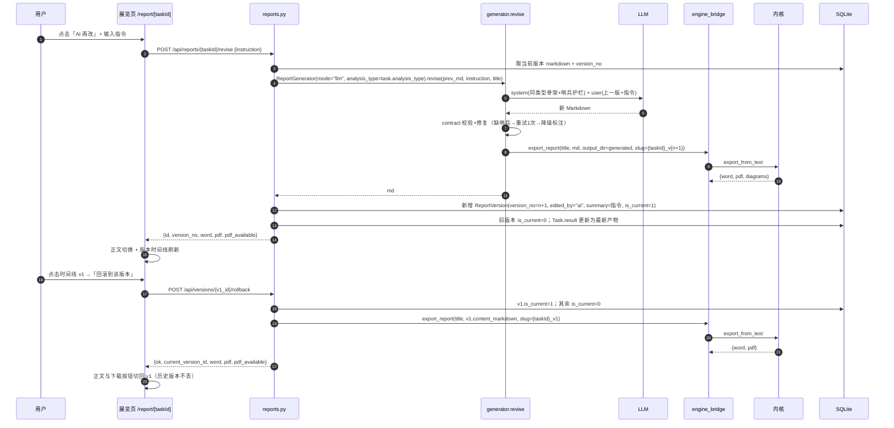
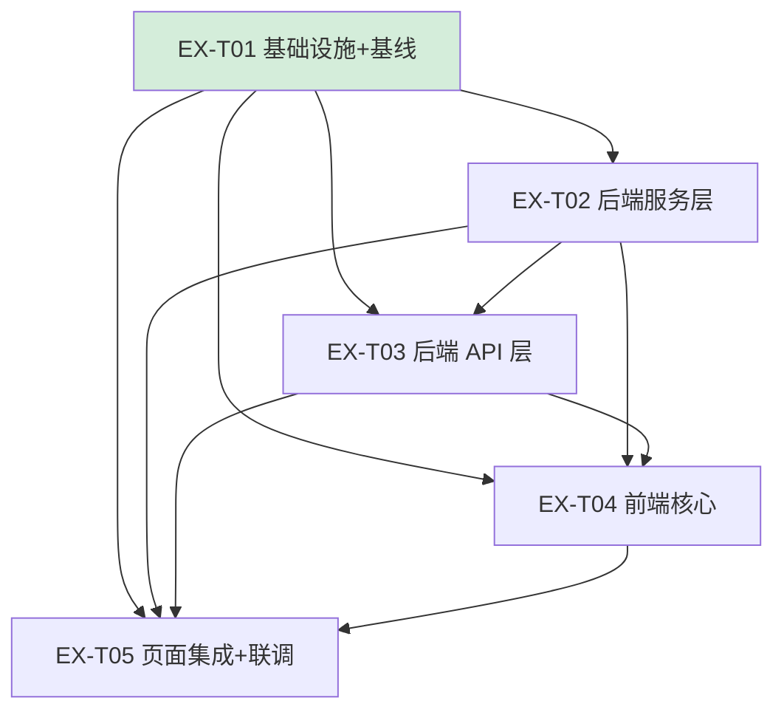

# 三元结构理论分析 SaaS — 系统设计与任务拆解

> 文档性质：**正式架构设计 + 工程师任务清单**（SOP 第二段产物，工程师实现的唯一依据）。
> 架构师：高见远（Bob）｜日期：2026-07-31｜上游输入：`prd-align-scrape.md`（唯一需求输入，D1–D5 已拍板）
> 仓库定位：**APP 应用层** `Web 分析模型/`（所有改动在此）· **KERNEL 内核层**（**零改动**，仅黑盒调用 `engine.export_from_text`）
> 代码依据：逐字核对 APP `backend/app/*`（约 5244 行）与 `frontend/*`；函数签名/路径均抄自代码实况。

---

## 1. 一句话架构结论

**在 APP 应用层把「AI 写 2 类报告 + 无联网 + 单图力导向」升级为「5 类型真映射 + 零 Key 联网检索抓取写报告 + 三态多图 + 版本留痕可回滚的展览页 + 案例库」的本地单机 SaaS；内核保持纯黑盒 `export_from_text` 调用，双轨护栏（前端所选类型 = LLM 提示词骨架 = 内核哨兵路由）由 APP 侧提示词与后校验单点保证。**

---

## 2. 改动全景（T0–T14 → 5 个实现任务）

> 实现任务（EX-T01…EX-T05）是工程师的直接执行单位；T 编号为需求追踪号，一一对应 PRD §4。

| T# | 需求 | 文件（真实相对路径） | 改动内容 | 依赖 | 优先级 | 归属实现任务 |
|---|---|---|---|---|---|---|
| T0 | 基线验证 | `docs/基线记录.md`（新） | 跑 `start.bat`，记录 case/policy 实际产出、`/api/tasks` 404、类型假映射 | — | P0 | EX-T01 |
| T1 | search 升级：检索+抓取+清洗+去重 | `backend/app/search.py`（重写） | DDG HTML 零 Key 默认源；BING/BRAVE Key 自动升级；`fetch_and_clean`/`dedupe_hits`/`clean_text` | — | P0 | EX-T02 |
| T2 | materials.py 素材组装+来源清单 | `backend/app/materials.py`（新） | `build_materials`→`MaterialBundle{items,sources}`；`format_materials_context`/`format_source_appendix` | T1 | P0 | EX-T02 |
| T3 | generator web_mode 分支 | `backend/app/generator.py` | `web_mode` 参数 + 素材注入 + 系统提示强制 `[名称](url)` 引用 | T1,T2 | P0 | EX-T02 |
| T4 | prompt_builder 5 类型+双轨护栏 | `backend/app/prompt_builder.py`、`backend/app/contract.py` | org(9)/opinion(7)/combo 三套骨架；`REQUIRED_SECTIONS` 扩 5 值；哨兵章节后校验 | — | P0 | EX-T02 |
| T5 | 前端 5 Tab 真映射 | `frontend/lib/constants.ts`、`frontend/lib/api.ts`、`frontend/components/AnalysisEngine.tsx` | 5 Tab：事件→case/政策→policy/组织→org/舆情→opinion/组合→combo；`AnalyzePayload.analysis_type` 扩 5 值 | T4 | P0 | EX-T04 |
| T6 | 三态图全量解析+三态渲染+配色 | `frontend/lib/network.ts`、`frontend/components/NetworkCanvas.tsx` | `parseDiagrams`(/g 全量)；`viz` 分流 network/org/flow；补 `identity_culture`/`event` 配色 | — | P0 | EX-T04 |
| T7 | 补 `GET /api/tasks` | `backend/app/routers/tasks.py`（新）、`backend/app/main.py` | 返回 runs（tasks 表）列表；对齐前端 `TaskDTO`；project_id/status/limit 过滤 | — | P0 | EX-T03 |
| T8 | 分析页改版：联网开关+来源预览+进度 | `backend/app/routers/search.py`（新）、`frontend/components/AnalysisEngine.tsx`、`backend/app/routers/analyze.py`、`backend/app/queue.py` | `POST /api/search/preview`；AnalyzeRequest 增 `web`/`source_urls`；queue 阶段 2 接抓取；来源勾选/剔除 UI；WS 进度复用 | T3,T7 | P1 | EX-T04(UI)/EX-T03(API) |
| T9 | 铁律自检面板 | `frontend/lib/rules.ts`（新）、`frontend/components/RulesPanel.tsx`（新） | 13 条静态 JSON + 机检项实时算（章节齐全/DIAGRAM 合法/附录格式/`——`≤8/段落≤5 行/套话黑名单/概念≤3）+ 人工勾选项 | — | P1 | EX-T05 |
| T10 | 报告展览页 | `frontend/app/report/[taskId]/page.tsx`（重构） | Word/PDF 下载 + 三态图查看器（多图 Tab）+ 章节正文阅读视图 | T6,T7 | P1 | EX-T05 |
| T11 | start.bat/部署核对 | `start.bat`、`backend/app/settings.py`、`backend/.env.example` | 127.0.0.1 绑定、CORS 3000、ENGINE_DIR 指内核（核对确认，不改语义） | — | P1 | EX-T01 |
| T12 | 全量联调 + e2e | `backend/tests/test_search.py`、`backend/tests/test_tasks_api.py`、`backend/tests/test_prompt_builder.py`（均新）+ 手工 e2e | 5 类型×联网主题全通；章节数与输入一致；Word/PDF/HTML 齐备 | T1–T10 | P0（收尾） | EX-T05 |
| T13 | 报告编辑+版本管理 | `backend/app/models.py`、`backend/app/db.py`、`backend/app/routers/reports.py`、`backend/app/generator.py`、`frontend/components/VersionTimeline.tsx`（新）、`frontend/app/report/[taskId]/page.tsx` | `report_versions` 扩展（version_no/edited_by/summary/is_current）；`POST /reports/{id}/revise`；`POST /versions/{id}/rollback`；手动改/AI 改各存一版并重渲 | T10 | P1 | EX-T02(数据层)/EX-T03(API)/EX-T05(UI) |
| T14 | cases 案例库（可编辑） | `backend/app/routers/cases.py`（新）、`frontend/app/cases/page.tsx`（新）、`frontend/components/layout/Sidebar.tsx` | `GET /api/cases`（ast 只读解析 KERNEL/cases/*.py）；`POST /api/cases/{id}/import`；列表/预览/套用/编辑四动作 | T13 | P1 | EX-T03(API)/EX-T05(UI) |

---

## 3. 实施方式与关键技术选型

### 3.1 核心难点与对策

| 难点 | 对策 |
|---|---|
| 零 Key 联网检索稳定可用 | DuckDuckGo HTML 端点（`https://html.duckduckgo.com/html/?q=`）零 Key；配置 `BING_SEARCH_KEY`/`BRAVE_SEARCH_KEY` 自动升级官方 API；抓取用 `trafilatura` 抽主文（纯文本规则，无浏览器依赖） |
| 双轨类型一致性（最要害） | 提示词强制哨兵章节标题 + 生成后契约校验（缺哨兵 → 重试 1 次 → 降级规则引擎并显式标注） |
| 三态图语义保真 | 前端 `parseDiagrams` 全量提取 + `NetworkCanvas` 按 `viz` 三态分流（org 层级树/flow 水平流/network 力导向），配色以 KERNEL `theory_config.json.visualization.node_types` 8 类为唯一真源 |
| 版本留痕可回滚 | 复用已有 `report_versions` 表，扩 4 列；产物按 `{task_id}_v{n}` 目录即时重渲，不落库二进制 |
| 案例库只读红线 | `cases/*.py` 用 `ast` 解析 `TITLE`/`BODY` 字符串字面量，**绝不 exec/import** 内核脚本 |

### 3.2 架构模式

- 后端：**分层 + 路由模块化**（现有结构不变）——`routers`（API）→ `queue`（异步编排）→ `generator`（生成编排）→ `search/materials`（素材服务）→ `engine_bridge`（内核黑盒门面）→ SQLite（SQLAlchemy ORM）。
- 前端：**Next.js App Router + TanStack Query + 组件化**（现状不变），新增 `RulesPanel`/`VersionTimeline`/三态图查看器等纯展示组件。
- 任务模型：沿用「数据库即队列 + 线程池工人 + WS 进度」；联网抓取在 `queue._process` 阶段 2 扩展，不加新队列。

### 3.3 文件清单（完整）

```
backend/
├── requirements.txt                 # 修改：+trafilatura（其余尽量复用现有依赖）
├── .env.example                     # 修改：+BING_SEARCH_KEY/BRAVE_SEARCH_KEY 示例
└── app/
    ├── settings.py                  # 修改：+bing/brave key、search 策略
    ├── search.py                    # 重写：DDG/BING/BRAVE + fetch_and_clean + dedupe
    ├── materials.py                 # 新增：素材组装 + 来源清单
    ├── generator.py                 # 修改：web_mode + revise 模式
    ├── prompt_builder.py            # 修改：5 类型骨架 + 哨兵护栏
    ├── contract.py                  # 修改：REQUIRED_SECTIONS 扩 5 值 + 哨兵校验
    ├── models.py                    # 修改：ReportVersion 扩 4 列
    ├── db.py                        # 修改：迁移 DDL
    ├── queue.py                     # 修改：阶段 2 接 web 抓取链
    ├── main.py                      # 修改：挂载 tasks/search/cases router
    └── routers/
        ├── analyze.py               # 修改：AnalyzeRequest +web/source_urls
        ├── reports.py               # 修改：versions 扩展 + revise + rollback
        ├── tasks.py                 # 新增：GET /api/tasks
        ├── search.py                # 新增：POST /api/search/preview
        └── cases.py                 # 新增：GET /api/cases + POST /api/cases/{id}/import
backend/tests/
    ├── test_search.py               # 新增：DDG 解析/去重/降级
    ├── test_prompt_builder.py       # 新增：5 类型骨架哨兵断言
    └── test_tasks_api.py            # 新增：GET /api/tasks 契约
frontend/
    ├── lib/constants.ts             # 修改：ANALYSIS_TABS 5 项
    ├── lib/api.ts                   # 修改：AnalyzePayload/TaskDTO/新端点客户端
    ├── lib/network.ts               # 修改：parseDiagrams + 8 类配色
    ├── lib/rules.ts                 # 新增：13 条铁律静态 JSON + 机检函数
    ├── components/AnalysisEngine.tsx# 修改：5 Tab + 联网开关 + 来源预览 + 进度
    ├── components/NetworkCanvas.tsx # 修改：三态渲染 props
    ├── components/RulesPanel.tsx    # 新增：铁律自检面板
    ├── components/VersionTimeline.tsx# 新增：版本时间线
    ├── components/layout/Sidebar.tsx# 修改：+案例库导航
    └── app/
        ├── report/[taskId]/page.tsx # 重构：展览页（三态图查看器/版本/下载）
        └── cases/page.tsx           # 新增：案例库页
docs/
    └── 基线记录.md                  # 新增：T0 产物
```

---

## 4. 关键接口设计

### 4.1 `search.py`（T1，重写现有文件）

现有 `search_web(query, provider, api_key, max_results) -> SearchResult|None` 保留兼容包装；新增策略自动选择。

```python
@dataclass
class SearchHit:
    title: str
    url: str
    snippet: str

@dataclass
class SearchResult:
    query: str
    hits: list[SearchHit]          # 统一 hits（替代旧 snippets/sources 分离）
    provider: str                  # "duckduckgo" | "bing" | "brave"

def search_web(query: str, max_results: int = 5) -> SearchResult | None:
    """检索源自动选择：BING_SEARCH_KEY → BRAVE_SEARCH_KEY → DuckDuckGo HTML（零 Key）。

    无任何 Key 也恒可执行（DDG）；任何源失败不静默——
    抛/返回带 provider 的失败标记，由调用方拼装 PRD §6 的明确降级提示。
    """
    ...

def _search_duckduckgo(query: str, max_results: int) -> list[SearchHit]:
    """GET https://html.duckduckgo.com/html/?q={query}（UA=浏览器），
    用 lxml 解析 .result__a(标题+href) 与 .result__snippet(摘要)。"""

def _search_bing(query: str, api_key: str, max_results: int) -> list[SearchHit]:
    """Bing Web Search API v7.0：GET https://api.bing.microsoft.com/v7.0/search
    Header Ocp-Apim-Subscription-Key。"""

def _search_brave(query: str, api_key: str, max_results: int) -> list[SearchHit]:
    """Brave Search API：GET https://api.search.brave.com/res/v1/web/search
    Header X-Subscription-Token。"""

def fetch_and_clean(urls: list[str], max_chars: int = 8000) -> list[dict]:
    """逐个抓取公开网页正文（requests + trafilatura.extract；失败降级
    readability-lxml；再失败去 script/style 后取文本）。返回
    [{title, url, text, snippet}]；text 截断 max_chars。抓取失败条目保留
    {title,url,text:"",error} 供前端/附录过滤。"""

def dedupe_hits(hits: list[SearchHit]) -> list[SearchHit]:
    """按 URL 归一（去 query 参数/协议差异）+ 标题相似度（difflib ratio>0.9 判重）。"""

def clean_text(html: str, url: str) -> str:
    """trafilatura → readability → 兜底去标签 三级降级。"""
```

降级策略（PRD §6）：DDG 超时/限流/解析失败 → `search_web` 返回 `SearchResult(provider="duckduckgo", hits=[], degraded="...")`；`queue` 阶段 2 将 `degraded` 写入 `Task.search_results` 并推送给前端；前端在来源预览区提示「检索源不可用，可配置 BING/BRAVE Key 或改用手动 URL 输入」，**不静默**。

### 4.2 `materials.py`（T2，新增）

```python
@dataclass
class SourceItem:
    title: str
    url: str

@dataclass
class MaterialBundle:
    items: list[dict]              # [{title, url, text, snippet, kept: bool}]
    sources: list[SourceItem]      # 来源清单 [{title, url}]（前端回显+附录唯一真源）

def build_materials(hits: list[SearchHit], fetched: list[dict],
                    excluded_urls: set[str]) -> MaterialBundle:
    """按用户剔除集合过滤，拼 items + sources。"""

def format_materials_context(bundle: MaterialBundle, max_chars: int = 24000) -> str:
    """拼成注入 generator 的素材块：每篇「[标题](url) + 正文截断」。"""

def format_source_appendix(sources: list[SourceItem]) -> str:
    """生成附录 Markdown：1. [标题](url)\n…（铁律 11 可点击格式）。"""
```

### 4.3 `generator.py`（T3 + T13）

```python
class ReportGenerator:
    def __init__(self, llm=None, analysis_type: str = "case", mode: str = "rule",
                 structured=None, llm_config: dict | None = None,
                 web_mode: bool = False, materials: dict | None = None) -> None:
        ...

    def _build_user_prompt(self, input_text: str, title: str | None,
                           materials: dict | None = None) -> str:
        """web_mode：在现有头尾之间插入素材块（format_materials_context），
        并追加「附录必须为 [名称](url) 可点击格式」约束。"""

    def generate(self, input_text: str = "", title: str | None = None) -> str:
        """现有逻辑不变；web_mode 在 LLM 分支传 materials 给 _build_user_prompt。"""

    def revise(self, previous_markdown: str, instruction: str,
               title: str | None = None) -> str:
        """T13 AI 再改：system = build_system_prompt(同 analysis_type)（含哨兵护栏）；
        user = 上一版全文 + 「修改指令：{instruction}」+「仅输出修改后的完整报告 Markdown」。
        复用 generate 的契约校验/修复/降级链。返回新 Markdown。"""
```

`queue._process` 阶段 2 改造（web 接入）：

```python
# 判定（替代现 search_on）：
web_on = task.web and (settings.search_enabled != "off")
if web_on and should_search(input_text):
    _update_phase("search", 15)
    if task.source_urls:                      # 用户勾选白名单 → 直接抓取
        fetched = search.fetch_and_clean(task.source_urls)
    else:                                     # 无白名单 → 检索+抓取
        result = search.search_web(derive_query(input_text), settings.search_max_results)
        hits = search.dedupe_hits(result.hits)
        fetched = search.fetch_and_clean([h.url for h in hits[:settings.search_max_results]])
    bundle = materials.build_materials(hits, fetched, excluded_urls)
    input_text = f"{input_text}\n\n{materials.format_materials_context(bundle)}"
    task.search_results = {query, provider, hits, degraded, bundle.sources}
# 之后 ReportGenerator(..., web_mode=True, materials=bundle.__dict__)
```

### 4.4 `prompt_builder.py` 5 类型骨架 + 双轨护栏（T4）

**5 类型骨架表**（哨兵标题逐字取自 KERNEL `parser._SECTION_IDS`，保证内核路由命中）：

| 类型 | Tab | 强制 `##` 章节（哨兵加粗） | 章节数 | REQUIRED_SECTIONS（contract.py） |
|---|---|---|---|---|
| `case` | 事件 | **案例事实摘要**/分析框架说明/**利益主体识别**/**利益动线与转化**/**制度与叙事作用**/三元结构分析正文/结论/附录 | 5~8 | 现有 4 项 + 哨兵 |
| `policy` | 政策 | 独立事实摘要/分析框架说明/**政策对象图谱**/**政策权重与空间分析**/三元结构分析正文/结论与推导/附录/数据溯源 | 8 | 现有 4 项 |
| `org` | 组织 | **组织画像**/**架构拆解与资金来源**/**生存诊断**/**繁衍诊断**/**利益关系网络与利益集团拆解**/**逆反诊断**/**利益转化与组织—社会关系**/诊断结论/附录 | 9 | org 哨兵 7 项 |
| `opinion` | 舆情 | **事件与时间线**/**利益主体与沉默方**/**叙事竞争矩阵**/**三元生命维度**/**逆反性质与层级**/**演化曲线与系统回应**/结论/附录 | 7 | opinion 哨兵 6 项 |
| `combo` | 组合 | 任意 ≥2 类���兵混编（作者源序） | 源序 | 校验「≥2 类哨兵」而非单类 |

**护栏具体实现**（双轨唯一主动防护点）：

```python
# prompt_builder.py
SENTINEL_SECTIONS = {
    "case":    ["案例事实摘要", "利益主体识别", "利益动线与转化", "制度与叙事作用"],
    "policy":  ["政策对象图谱", "政策权重与空间分析"],
    "org":     ["组织画像", "架构拆解与资金来源", "生存诊断", "繁衍诊断",
                "利益关系网络与利益集团拆解", "逆反诊断", "利益转化与组织—社会关系"],
    "opinion": ["事件与时间线", "利益主体与沉默方", "叙事竞争矩阵",
                "三元生命维度", "逆反性质与层级", "演化曲线与系统回应"],
    "combo":   [],  # 组合不强制单类
}

def build_system_prompt(analysis_type: str = "case") -> str:
    # ...现有 base/structure/theory 拼接...
    guard = SENTINEL_SECTIONS.get(analysis_type, [])
    if guard:
        lines = "\n".join(f"## {s}" for s in guard)
        return f"""{现有内容}

# 类型一致性强制（必须原样包含以下 ## 二级标题，缺任一即视为生成失败）
{lines}
"""
```

```python
# contract.py —— 生成后护栏（防 LLM 不听话）
REQUIRED_SECTIONS.update({
    "org":     ["组织画像", "架构拆解与资金来源", "生存诊断", "繁衍诊断",
                "利益关系网络与利益集团拆解", "逆反诊断", "利益转化与组织—社会关系"],
    "opinion": ["事件与时间线", "利益主体与沉默方", "叙事竞争矩阵",
                "三元生命维度", "逆反性质与层级", "演化曲线与系统回应"],
    "combo":   [],  # 组合走「≥2 类哨兵」校验（新增 _count_sentinel_modes()）
})
# validate_and_repair 增加：missing 含哨兵时 errors 标 "type_mismatch"，
# generator 对 type_mismatch 重试 1 次（temperature 提高 0.2）→ 仍失败降级规则引擎并标注。
```

### 4.5 新增/修改端点（T7/T8/T13/T14）

**`GET /api/tasks`**（新 router `tasks.py`；响应对齐前端 `TaskDTO`，逐字段）：

```json
[
  {
    "task_id": "a1b2c3...",         // Task.id
    "title": "报告标题",
    "status": "done",               // queued|generating|done|error
    "analysis_type": "org",         // Task.analysis_type
    "project_id": "auto_xxx" | null,
    "created_at": "2026-07-31T12:00:00+00:00"
  }
]
```
Query：`?project_id=&status=&limit=`（limit 默认 50，按 created_at desc）。

**`POST /api/search/preview`**（新 router `search.py`；T8 来源预览，即时返回不落库）：

```json
请求 {"query": "关键词"}
响应 {"query": "...", "provider": "duckduckgo",
      "hits": [{"title": "...", "url": "https://...", "snippet": "..."}],
      "degraded": null}
```

**`POST /api/analyze`**（改 `analyze.py` `AnalyzeRequest`，向后兼容）：
```python
class AnalyzeRequest(BaseModel):
    title: str
    input_text: str = ""
    analysis_type: str = "case"        # 扩为 case|policy|org|opinion|combo
    project_id: str | None = None
    mode: str = "rule"
    structured: dict | None = None
    llm_config: dict | None = None
    material_ids: list[str] | None = None
    search: bool | None = None         # 保留兼容
    web: bool = False                  # 新增：联网写报告
    source_urls: list[str] | None = None  # 新增：用户勾选白名单（null=自动检索全部）
```

**`POST /api/reports/{task_id}/revise`**（改 `reports.py`；T13 AI 再改）：

```json
请求 {"instruction": "把第三章改写得更尖锐", "llm_config": {"model": "...", "temperature": 0.4}}
响应 {"id": "ver_id", "version_no": 3, "kind": "revised", "edited_by": "ai",
      "summary": "把第三章改写得更尖锐", "created_at": "...", "is_current": true,
      "word": "/api/download/{task_id}?kind=word", "pdf_available": true}
```

**`GET /api/reports/{task_id}`（改，版本列表）**——现有返回上扩展字段：

```json
{"task_id": "...", "title": "...", "current_version_id": "...",
 "versions": [{"id": "...", "version_no": 1, "kind": "original", "edited_by": "ai",
               "summary": "自动生成（联网检索）", "note": "...", "editor": "系统",
               "created_at": "...", "is_current": false}]}
```

**`POST /api/versions/{vid}/rollback`**（改 `reports.py`；T13 回滚）：

```json
请求 {}
响应 {"ok": true, "current_version_id": "...", "version_no": 1,
      "word": "/api/download/{task_id}?kind=word", "pdf_available": true}
```

**`GET /api/cases`**（新 router `cases.py`；T14，ast 只读解析 KERNEL `cases/*.py`，不 exec）：

```json
{"total": 12,
 "cases": [{"id": "run_mixue_org", "name": "蜜雪冰城组织架构…", "analysis_type": "org",
            "chapters": 9, "script": "cases/run_mixue_org.py", "title": "TITLE 值",
            "markdown": "BODY 全文", "diagrams": [{"viz": "org", "title": "...",
             "nodes": [...], "edges": [...]}]}]}
```

**`POST /api/cases/{id}/import`**（T14 编辑入口）：读 BODY → 创建 `Task(status=done, result={markdown:BODY})` + 播种 `original` 版本 → 返回 `{"task_id": "..."}` → 前端跳 `/report/{taskId}/edit` 走 T13 留痕。**绝不写回 KERNEL 脚本**。

### 4.6 SQLite 版本表 DDL（T13）

已有 `report_versions`（id/task_id/kind/content_markdown/content_html/note/editor/created_at），扩展 4 列（`db.py` 迁移沿用现有 ALTER 模式）：

```sql
ALTER TABLE report_versions ADD COLUMN version_no INTEGER DEFAULT 1;   -- v1/v2/v3…
ALTER TABLE report_versions ADD COLUMN edited_by VARCHAR(16) DEFAULT 'ai'; -- human|ai
ALTER TABLE report_versions ADD COLUMN summary VARCHAR(500);           -- 改动摘要
ALTER TABLE report_versions ADD COLUMN is_current INTEGER DEFAULT 0;   -- 回滚语义
```

关系：`report_versions.task_id → tasks.id`（已存在，ON DELETE CASCADE）；`tasks` 增无新列，当前版本 = `is_current=1` 行（回滚即切换该标记）。**回滚语义**：切换 `is_current` 后立即 `export_report` 重渲，产物写 `backend/generated/{task_id}_v{n}/`，历史版本产物不删除（重渲覆盖同 slug 目录）。

### 4.7 前端关键改动（T5/T6/T8/T13/T14）

**`lib/constants.ts`**：
```ts
export const ANALYSIS_TABS = ["事件分析", "政策分析", "组织分析", "舆情分析", "组合分析"];
export const ANALYSIS_TYPE = ["case", "policy", "org", "opinion", "combo"] as const;
```

**`lib/api.ts`**：
```ts
export interface AnalyzePayload {
  ...
  analysis_type?: "case" | "policy" | "org" | "opinion" | "combo";
  web?: boolean;              // 新增
  source_urls?: string[];     // 新增
}
export interface TaskDTO { task_id; title; status; analysis_type; project_id; created_at; } // 不变
export async function searchPreview(query): Promise<SearchPreviewResult>;   // 新增
export async function reviseReport(taskId, body): Promise<ReportVersionMeta>; // 新增
export async function rollbackVersion(vid): Promise<RollbackResult>;          // 新增
export async function getCases(): Promise<CaseList>;                          // 新增
```

**`lib/network.ts`**：
```ts
export function parseDiagrams(md?: string | null): Diagram[] {
  // /```DIAGRAM\s*([\s\S]*?)```/g 循环取全部，逐个 JSON.parse，坏块跳过
}
// 保留 parseDiagram 单数兼容（返回第一张）

export const INTEREST_TYPE_COLOR: Record<string, string> = {
  actor: "#34495E", material: "#E74C3C", security: "#F39C12",
  political: "#2E86C1", identity_culture: "#8E44AD",
  institutional_future: "#1ABC9C", public: "#27AE60", event: "#E67E22",
};
// 删掉错误 key：safety/identity；补 identity_culture/event（与 theory_config.json 一致）
```

**`components/NetworkCanvas.tsx`**：
```ts
export interface NetworkCanvasProps {
  nodes: DiagramNode[];
  edges: DiagramEdge[];
  viz?: "network" | "org" | "flow";   // 新增，默认 "network"
  centerId?: string;
}
// viz==="org"  → physics.enabled=false + layout.hierarchical={enabled:true, direction:"UD"}
// viz==="flow" → physics.enabled=false + layout.hierarchical={enabled:true, direction:"LR"}
// viz==="network" → 现状力导向
```

**AnalysisEngine 状态流（T8）**：新增 `webOn`(默认 true)、`previewHits[]`、`excludedUrls:Set`。提交流程：输入区聚焦/回车 → `searchPreview(query)` 填充来源预览列表 → 用户勾选/剔除 → 点击「开始分析」→ `POST /api/analyze {web:webOn, source_urls: 勾选URLs, ...}` → WS 进度复用（检索→抓取→起草→排版→输出）→ done 跳 `/report/{taskId}`。

**新页面/组件**：`/cases`（列表+预览抽屉+套用/编辑）、`RulesPanel`（13 条铁律机检+人工勾选）、`VersionTimeline`（vN/时间戳/摘要/human-ai 徽标/回滚按钮）。

---

## 5. 数据模型与接口（classDiagram）



---

## 6. 程序调用时序（sequenceDiagram）

### 6.1 丢关键词联网写报告全流程（T1–T3/T8）



### 6.2 展览页 AI 再改 → revise → 新版本 → 重渲（T13）



---

## 7. 任务列表（工程师执行序）

> 5 个实现任务（硬上限），按依赖排序；每个任务含验收点。T0–T14 已映射进各任务。

### EX-T01 项目基础设施 + 基线核对（P0）
- **文件**：`start.bat`、`backend/requirements.txt`、`backend/.env.example`、`backend/app/settings.py`、`docs/基线记录.md`
- **内容**：① T11 核对（127.0.0.1 绑定、CORS 3000、ENGINE_DIR 指内核）；② T0 跑 `start.bat` 记录现状（case/policy 各一篇 + `/api/tasks` 404 + 类型假映射）；③ requirements 加 `trafilatura`（其余复用现有依赖）；④ `.env.example` 加 `BING_SEARCH_KEY`/`BRAVE_SEARCH_KEY`；⑤ settings.py 加 `bing_search_key`/`brave_search_key`/`search_strategy` 配置项
- **依赖**：无
- **验收**：`start.bat` 前后端拉起；`/health` 返回 ok；基线文档记录 3 个现状事实

### EX-T02 后端服务层：检索/素材/生成/类型/数据模型（P0）
- **文件**：`backend/app/search.py`、`backend/app/materials.py`、`backend/app/generator.py`、`backend/app/prompt_builder.py`、`backend/app/contract.py`、`backend/app/models.py`、`backend/app/db.py`、`backend/tests/test_search.py`、`backend/tests/test_prompt_builder.py`
- **内容**：T1 search 重写（DDG/BING/BRAVE + fetch_and_clean + dedupe）；T2 materials.py；T3 generator web_mode；T4 prompt_builder 5 类型 + contract 护栏；T13 数据层（ReportVersion 扩 4 列 + db.py 迁移）
- **依赖**：EX-T01
- **验收**：`pytest` 通过 test_search（DDG 解析/去重/降级）与 test_prompt_builder（5 类型骨架哨兵逐一断言「所选类型命中内核哨兵」）；`python -c "from app.search import search_web; print(search_web('测试').provider)"` 返回 duckduckgo 且不抛异常

### EX-T03 后端 API 层：任务/搜索预览/版本/案例/队列接入（P0/P1）
- **文件**：`backend/app/routers/tasks.py`（新）、`backend/app/routers/search.py`（新）、`backend/app/routers/cases.py`（新）、`backend/app/routers/analyze.py`、`backend/app/routers/reports.py`、`backend/app/queue.py`、`backend/app/main.py`、`backend/tests/test_tasks_api.py`
- **内容**：T7 `GET /api/tasks`；T8 `POST /api/search/preview` + AnalyzeRequest `web/source_urls` + queue 阶段 2 抓取链；T13 `revise`/`versions` 扩展/`rollback`（含即时重渲）；T14 `GET /api/cases` + `POST /api/cases/{id}/import`；main.py 挂载新 router
- **依赖**：EX-T01、EX-T02
- **验收**：curl 验证——`GET /api/tasks` 返回 TaskDTO 数组；`POST /api/search/preview` 有真实 hits 或明确 degraded；`POST /api/reports/{id}/revise` 后版本 +1 且 `word` 可下载；`POST /api/versions/{v1}/rollback` 后 `current_version_id` 指向 v1 且重渲成功；`GET /api/cases` 返回 12 篇（不含模板 run_report.py）

### EX-T04 前端核心：类型 5 Tab + 三态图 + 分析页改版（P0）
- **文件**：`frontend/lib/constants.ts`、`frontend/lib/api.ts`、`frontend/lib/network.ts`、`frontend/components/NetworkCanvas.tsx`、`frontend/components/AnalysisEngine.tsx`
- **内容**：T5 5 Tab 真映射；T6 `parseDiagrams`(/g) + `viz` 三态分流 + `identity_culture`/`event` 配色；T8 分析页 UI（联网开关默认开 + 来源预览勾选剔除 + 进度条复用 WS）
- **依赖**：EX-T01、EX-T02、EX-T03（analyze 契约与 preview 端点）
- **验收**：5 Tab 逐一选择后 `POST /api/analyze` 的 `analysis_type` 与 Tab 一致；含 3 张 DIAGRAM 的报告三图全展示且 org 呈层级树、flow 呈水平流；无灰色英文标签节点；来源预览可剔除后再提交

### EX-T05 前端页面集成 + 联调收尾（P0/P1）
- **文件**：`frontend/app/report/[taskId]/page.tsx`、`frontend/app/cases/page.tsx`（新）、`frontend/lib/rules.ts`（新）、`frontend/components/RulesPanel.tsx`（新）、`frontend/components/VersionTimeline.tsx`（新）、`frontend/components/layout/Sidebar.tsx`、`backend/tests/*`（e2e 用例补齐）
- **内容**：T10 展览页重构（Word/PDF 下载 + 三态图查看器 + 正文阅读）；T9 铁律自检面板；T13 前端（版本时间线/手动改/AI 改/回滚入口）；T14 前端（案例库列表/预览/套用/编辑）；T12 全量联调 + e2e
- **依赖**：EX-T01–EX-T04
- **验收**：PRD §8 总体验收口径 1–6 全过（双击 start.bat 5 页有数据；关键词+URL 各 1 篇；5 类型双轨一致；手动改+AI 改各 1 次→版本时间线 ≥3 版可回滚 v1 重渲；案例库预览/套用/编辑可用；e2e 通过）

### 任务依赖图



> 注：T03 的 `GET /api/tasks`（T7）仅依赖 EX-T01（tasks 表已存在），可在 EX-T02 未完成时先行；T04 的 NetworkCanvas 三态渲染（T6）仅依赖 EX-T01，可并行。依赖图取保守上界。

---

## 8. 依赖包列表

| 位置 | 包 | 版本 | 用途 | 离线约束 |
|---|---|---|---|---|
| 后端（新增） | `trafilatura` | ≥1.8 | 网页主文抽取（纯规则，无浏览器） | 尽量少加：仅此 1 个新增；其余复用现有 `requests`(经 urllib 可换)/`lxml`/`python-docx` 等 |
| 后端（复用） | `fastapi`/`uvicorn`/`sqlalchemy`/`openai`/`python-docx`/`lxml`/`matplotlib`/`networkx`/`Pillow`/`pypdf`/`python-dotenv` | 现有 requirements | 不变 | 已在 `.venv` |
| 前端 | 无新增 | — | 三态图沿用 `vis-network/standalone`（已在 node_modules）；Markdown 渲染沿用 `react-markdown`+`remark-gfm` | 零新增 |

> 说明：DDG HTML 解析用现有 `lxml`（不用 BeautifulSoup）；若 `trafilatura` 安装失败，降级方案为 `readability-lxml`（同样轻量），二者选一即可，**不引入 playwright/selenium**。

---

## 9. 共享知识 / 跨文件约定

1. **DIAGRAM JSON 字段唯一真源** = 内核契约：`{"viz":"network|org|flow","title":str,"focus":可选,"nodes":[{"id","label","type"}],"edges":[{"source","target","label","type"}]}`。**禁止 `from/to/relation`**（否则内核静默丢图）。APP 侧 `contract.VALID_NODE_TYPES`/`VALID_EDGE_TYPES` 与 KERNEL `theory_config.json.visualization.node_types/edge_types` 保持一致（8 类节点：`material/security/political/identity_culture/institutional_future/public/actor/event`；4 类边：`economic/power/cultural/legal`）。
2. **来源清单 `[{title,url}]` 三处一致**：`materials.py` 生成 → `generator` 注入附录约束 → 前端回显/校验。附录格式强制 `[名称](url)`，禁止裸 URL/无链接媒体名（铁律 11）。
3. **版本号命名**：`version_no` 从 1 起，展示为 `v1/v2/v3…`；`original` 恒为 v1，`edited_by="ai"`；手动保存 `edited_by="human"`；AI 再改 `edited_by="ai"`。
4. **时间戳格式**：ISO 8601 UTC（`datetime.now(timezone.utc).isoformat()`，与现有 `_now()` 一致）。
5. **错误信封**：HTTP 异常统一 `{error, message}`；业务性失败（如 PDF 不可用）返回 `{error:"pdf_unavailable", message}`（已有契约，不改）。
6. **密钥铁律**：`BING_SEARCH_KEY`/`BRAVE_SEARCH_KEY`/LLM key 只进 `backend/.env` 或 `backend/data/llm_settings.json`；前端请求体（含 `AnalyzePayload`）**绝不携带 api_key**。
7. **`analysis_type` 5 值**：`case|policy|org|opinion|combo`；前端 Tab 与后端 `prompt_builder`/`contract.REQUIRED_SECTIONS`/KERNEL 哨兵四方一一对应。
8. **��物目录**：`backend/generated/{task_id}/`（原始）与 `backend/generated/{task_id}_v{n}/`（各版本）；`slug` 传 task_id（现有约定）。
9. **cases 只读**：KERNEL `cases/*.py` 与 `theory_config.json` 只读引用，禁止写回；`GET /api/cases` 用 `ast` 解析，绝不 `exec`。
10. **既有路由语义不破坏**：不引入认证/多租户；登录页 token 维持现状；双轨维持现状。

---

## 10. 风险与对策（≤5）

| # | 风险 | 对策 |
|---|---|---|
| 1 | **DDG HTML 被限流/改版/解析失败**（零 Key 源不稳定） | `_search_duckduckgo` 加 UA + 超时(8s) + 重试 1 次；失败**不静默**——写 `degraded` 标记并前端提示「检索源不可用，可配置 BING/BRAVE Key 或改用手动 URL 输入」；配 Key 自动升级（D1） |
| 2 | **LLM 产出章节标题不守护栏**（双轨错位） | 三层防线：①系统提示词强制哨兵标题；②`contract.validate_and_repair` 按 `analysis_type` 后校验，`type_mismatch` → 提高 temperature 重试 1 次 → 仍失败降级规则引擎并标注 `degraded_from_llm`；③前端徽标展示 `contract.errors` |
| 3 | **版本表膨胀 + 产物堆积**（每次保存全文 Markdown + 重渲文件） | 版本表只存 Markdown（不存二进制）；产物按 `{task_id}_v{n}` 目录即时重渲、同 slug 覆盖；单机单用户场景可接受；`DELETE /api/reports/{id}` 已级联清理版本与产物（现有逻辑） |
| 4 | **cases 源文件只读 vs 可编辑需求边界** | 「编辑」= `POST /api/cases/{id}/import` 复制为 Task + ReportVersion（留痕），**绝不写回 KERNEL 脚本**；套用 = 前端预填骨架进分析页；红线不破 |
| 5 | **抓取内容质量差/正文抽取失败/来源重复** | 三级抽取降级（trafilatura→readability→去标签）；正文截断 max_chars；URL 归一 + 标题相似度去重；抓取失败条目标注 error 供前端剔除；只抓公开内容（D2），不碰登录态/反爬 |

---

## 11. 待澄清项（非阻塞）

- 无新增待确认问题（PRD D1–D5 已全部拍板）。
- 工程提示：若联调命中内核「单模式静默丢章节」（R3），按 PRD §7 红线**不改内核**，以「章节数与输入一致」为显式验收项，命中则单独立项。

*设计完 · 架构师：高见远（Bob）· 请工程师（下一段）按 EX-T01→EX-T05 顺序实现。*
