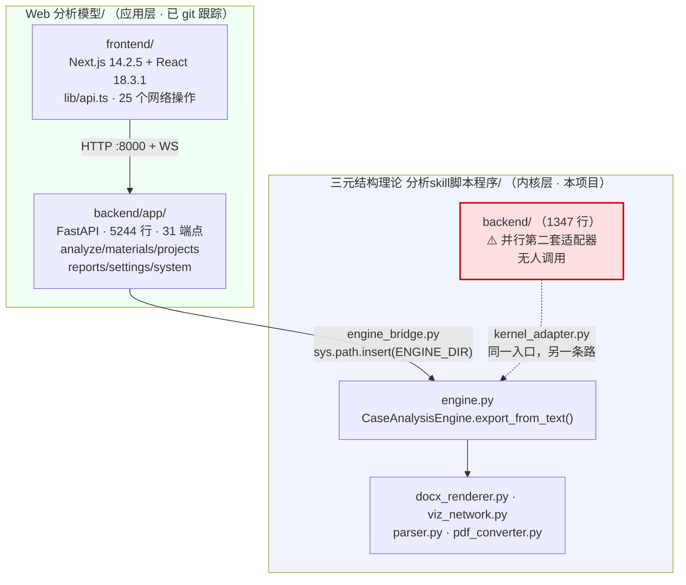
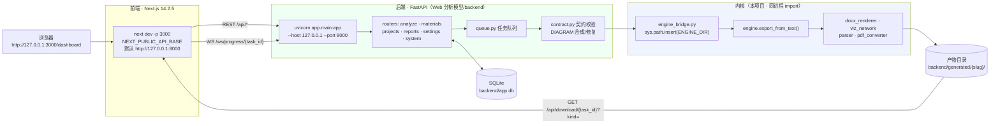
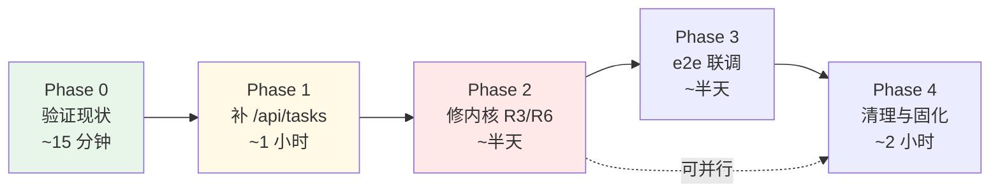

# 前端 ↔ 后端对接 + 本地部署 设计方案

> 文档性质：**只读设计方案**，不改动任何源文件。
> 产出人：架构师（Bob） · 输入：`architecture-review.md`（837 行）+ 两侧真实源码
> 所有端点名、字段名、路径均**逐字抄自代码**，未作推测；推测处均显式标注「待确认」。

---

## 0. 阅读须知：本方案推翻了任务书的一个前提

任务书假设「前端尚未连接后端，需要把 `Web 分析模型/frontend` 搬到本项目、与本项目 `backend/` 对齐契约」。

**实地核查后，这个前提不成立。** 关键证据（`Web 分析模型/backend/app/settings.py:16-19`）：

```python
# 域引擎默认路径（实测确认的活动版目录）；可用 ENGINE_DIR 覆盖。
DEFAULT_ENGINE_DIR = (
    r"D:\360MoveData\Users\马格斯佩斯科夫\Desktop\理论\三元结构理论"
    r"\程序\三元结构理论 分析skill脚本程序"
)
```

即：`Web 分析模型` **自带一套 5244 行的 FastAPI 后端**，而且它的域引擎路径**默认就指向本项目**。前端不是「没连后端」，而是**早已连好了另一套后端，且那套后端已经在调本项目的内核**。

因此本方案的核心结论与任务书预设方向相反，详见 §1、§2。请优先读这两节再看其余。

---

## 1. 现状结论（一句话版）

> **后端成熟、前端成熟、对接早已完成——真正的问题不是「怎么连」，而是「本项目里存在第二套并行后端（`backend/`，1347 行），它与前端契约几乎完全不兼容，且是整套系统里唯一没被使用的那一层」。推荐不要迁移前端，而是确认 `Web 分析模型` 为应用层、本项目为内核层，并冻结本项目的 `backend/`。**

分项判断：

| 维度 | 结论 | 证据 |
|---|---|---|
| 内核成熟度 | **高**。`engine.py` / `docx_renderer.py` / `viz_network.py` / `parser.py` 等 8 个模块，唯一出口 `CaseAnalysisEngine.export_from_text()`（`engine.py:41`） | 本项目根目录 |
| `Web 分析模型/backend` 成熟度 | **高**。5244 行，6 个 router、31 个端点、LLM 接入、契约校验（`contract.py`）、WebSocket 进度、报告版本、素材库、联网搜索、13 个测试文件 | `Web 分析模型/backend/app/` |
| 本项目 `backend/` 成熟度 | **中，但已成孤儿**。1347 行、4 个 router，与前端契约**近乎零交集** | 本项目 `backend/` |
| 前端成熟度 | **高**。Next.js 应用，`lib/api.ts` 512 行、25 个网络操作，页面覆盖 dashboard / projects / report / interest-analysis 等 | `Web 分析模型/frontend/` |
| 对接可行性 | **已对接**。`start.bat` 可一键拉起前后端，前端 `BASE` 默认 `http://127.0.0.1:8000`，Web 后端 CORS 已放行 3000 | `start.bat`、`api.ts:2`、`main.py:33` |
| 真实待办 | 只有 **1 个真实契约缺口**（`/api/tasks` 404）+ **3 个内核级风险**（R3/R4/R6） | 见 §4、§5 |

### 1.1 一处事实修正

任务书称前端为「React 19 / Next 15」。实测 `package.json`：

| 项 | 任务书说法 | **实际** |
|---|---|---|
| Next.js | 15 | **14.2.5** |
| React | 19 | **18.3.1** |

不影响结论，但会影响后续依赖升级判断，故记录在此。

---

## 2. 系统真实拓扑

两个目录不是「新旧两版」，而是**分层关系**——这是设计意图，不是历史包袱：



### 2.1 两套适配器调的是同一个内核入口

| | `Web 分析模型/backend` | 本项目 `backend/` |
|---|---|---|
| 桥接文件 | `app/engine_bridge.py` | `kernel_adapter.py` |
| 路径注入 | `sys.path.insert(0, settings.engine_dir)` | `sys.path.insert(0, KERNEL_SYS_PATH)` |
| 内核调用 | `engine.CaseAnalysisEngine().export_from_text(title, markdown, output_dir, slug)` | `export_from_text(title, body, output_dir=, slug=)` |
| 并发保护 | 队列 `queue.py` | 全局 `threading.Lock` |
| 结论 | **完全等价的两条路** —— 重复建设 | |

> 这就是「本项目 `backend/` 是孤儿」的技术依据：它没有提供任何 `Web 分析模型/backend` 不具备的能力，却维护着一套互不兼容的契约。

---

## 3. 前端 API 契约（逐字抄自 `lib/api.ts`）

Base URL 配置点（`lib/api.ts:2`）：

```ts
const BASE = process.env.NEXT_PUBLIC_API_BASE || "http://127.0.0.1:8000";
```

WebSocket 地址**硬编码**（`lib/api.ts:197`，非 BASE 派生，属技术债）：

```ts
const ws = new WebSocket(`ws://127.0.0.1:8000/ws/progress/${taskId}`);
```

前端全部 25 个网络操作：

| # | 前端函数 | 方法 + 路径 | 关键请求/响应字段 |
|---|---|---|---|
| 1 | `getSearchSettings` | `GET /api/settings/search` | → `available, configured, provider, enabled_mode` |
| 2 | `startAnalyze` | `POST /api/analyze` | ← `title, input_text, analysis_type, mode, structured, llm_config, project_id, material_ids, search` → `task_id` |
| 3 | `getAnalyze` | `GET /api/analyze/{task_id}` | → `task_id, status, engine_used, degraded_from_llm, data{markdown,word,pdf,pdf_available,diagrams,contract}` |
| 4 | `retryTask` | `POST /api/analyze/{task_id}/retry` | → `new_task_id, retry_of, attempt_no` |
| 5 | `getLlmSettings` | `GET /api/settings/llm` | → `has_settings, has_key, provider, model, base_url_masked, prompt_version, temperature` |
| 6 | `saveLlmSettings` | `POST /api/settings/llm` | ← `provider, api_key, base_url, model, temperature, prompt_version` |
| 7 | `getAppConfig` | `GET /api/settings/config` | → `engine_mode, default_analysis_level, ... weekly_digest` |
| 8 | `saveAppConfig` | `POST /api/settings/config` | ← `Partial<AppConfig>` |
| 9 | `connectProgress` | `WS /ws/progress/{task_id}` | → `{status, data, phase, progress_pct}` |
| 10 | `downloadUrl`/`downloadVersion` | `GET /api/download/{task_id}?kind=&version=` | `kind=word\|pdf`；失败体 `{error:"pdf_unavailable"}` |
| 11 | `getReportVersions` | `GET /api/reports/{task_id}` | → `task_id, title, current_version_id, versions[]` |
| 12 | `getReportVersion` | `GET /api/reports/{task_id}/versions/{vid}` | → `content_markdown, content_html` |
| 13 | `saveReportVersion` | `POST /api/reports/{task_id}/versions` | ← `content_html, content_markdown, note` |
| 14 | `deleteReport` | `DELETE /api/reports/{task_id}` | → `{status}` |
| 15 | `getProjects` | `GET /api/projects` | → `ProjectDTO[]`（`id,name,description,status,subjects,interests,chapters,progress,owner_name,updated_at`） |
| 16 | `deleteProject` | `DELETE /api/projects/{id}?confirm=true` | → `{ok, project_id, tasks_deleted}` |
| 17 | `deleteProjects` | `DELETE /api/projects` | ← `{ids, confirm}` → `{ok, deleted[], failed[], deleted_count}` |
| 18 | `getProject` | `GET /api/projects/{id}` | → `ProjectDTO`；未找到判定 `d.status === "not_found"` |
| 19 | **`getTasks`** | **`GET /api/tasks?project_id&status&limit`** | → `TaskDTO[]`（`task_id,title,status,analysis_type,project_id,created_at`） |
| 20 | `getMaterials` | `GET /api/materials?project_id&q` | → `MaterialMeta[]` |
| 21 | `getMaterialStats` | `GET /api/materials/stats` | → `total, by_type, by_source[], with_warnings, linked_to_project` |
| 22 | `getMaterial` | `GET /api/materials/{id}` | → `MaterialFull`（含 `content_text`） |
| 23 | `createMaterial` | `POST /api/materials` | ← `project_id,title,content_text,source_type,source,tags` |
| 24 | `uploadMaterial` | `POST /api/materials/upload` | ← `FormData` |
| 25 | `deleteMaterial` | `DELETE /api/materials/{id}` | — |

---

## 4. 契约对齐核对表

### 4.1 前端 ↔ `Web 分析模型/backend`（推荐路径）

后端端点抄自 `app/routers/*.py` 的装饰器行号。

| # | 前端调用 | Web 后端端点 | 状态 |
|---|---|---|---|
| 1 | `GET /api/settings/search` | `settings.py:50` | ✅ 一致 |
| 2 | `POST /api/analyze` | `analyze.py:33` | ✅ 一致 |
| 3 | `GET /api/analyze/{id}` | `analyze.py:58` | ✅ 一致 |
| 4 | `POST /api/analyze/{id}/retry` | `analyze.py:88` | ✅ 一致 |
| 5 | `GET /api/settings/llm` | `settings.py:31` | ✅ 一致 |
| 6 | `POST /api/settings/llm` | `settings.py:37` | ✅ 一致 |
| 7 | `GET /api/settings/config` | `settings.py:81` | ✅ 一致 |
| 8 | `POST /api/settings/config` | `settings.py:87` | ✅ 一致 |
| 9 | `WS /ws/progress/{id}` | `analyze.py:164` | ✅ 一致 |
| 10 | `GET /api/download/{id}` | `analyze.py:203` | ✅ 一致 |
| 11 | `GET /api/reports/{id}` | `reports.py:52` | ✅ 一致 |
| 12 | `GET /api/reports/{id}/versions/{vid}` | `reports.py:114` | ✅ 一致 |
| 13 | `POST /api/reports/{id}/versions` | `reports.py:82` | ✅ 一致 |
| 14 | `DELETE /api/reports/{id}` | `reports.py:139` | ✅ 一致 |
| 15 | `GET /api/projects` | `projects.py:265` | ✅ 一致 |
| 16 | `DELETE /api/projects/{id}` | `projects.py:203` | ✅ 一致 |
| 17 | `DELETE /api/projects` | `projects.py:227` | ✅ 一致 |
| 18 | `GET /api/projects/{id}` | `projects.py:275` | ✅ 一致 |
| **19** | **`GET /api/tasks`** | **❌ 不存在** | ⚠️ **必修** |
| 20 | `GET /api/materials` | `materials.py:183` | ✅ 一致 |
| 21 | `GET /api/materials/stats` | `materials.py:202` | ✅ 一致（注意声明顺序先于 `/{mid}`，未被吞路由，正确） |
| 22 | `GET /api/materials/{id}` | `materials.py:241` | ✅ 一致 |
| 23 | `POST /api/materials` | `materials.py:129` | ✅ 一致 |
| 24 | `POST /api/materials/upload` | `materials.py:150` | ✅ 一致 |
| 25 | `DELETE /api/materials/{id}` | `materials.py:250` | ✅ 一致 |

**对齐率 24/25。** 后端另有前端未用的富余端点：`POST /api/projects`、`PUT /api/projects/{pid}`、`PATCH .../archive`、`PATCH .../restore`、`GET .../detail`、`GET /api/analyze/{id}/poll`、`GET /health`。

#### ⚠️ 唯一缺口：`GET /api/tasks` — 影响 5 个页面

全仓 grep `api/tasks` 在后端**零命中**。而 `useTasks` 被以下页面消费：

| 页面 | 调用 |
|---|---|
| `app/dashboard/page.tsx:27` | `useTasks({ limit: 50 })` |
| `app/interest-analysis/page.tsx:26` | `useTasks({ status: "done", limit: 50 })` |
| `app/projects/[id]/page.tsx:24` | `useTasks({ project_id: id, limit: 50 })` |
| `app/report/page.tsx:20` | `useTasks({ limit: 100 })` |
| `app/report/[taskId]/edit/page.tsx:25` | `useTasks({ limit: 100 })` |

> **这正是任务书里「评审提到前端有 `/reports` 无参路由但后端缺对应端点」所指现象的真身**——真实缺口是 `/api/tasks`，不是 `/reports`（`/api/reports/{task_id}` 是存在的）。
>
> 影响：仪表盘、报告列表、项目详情三处列表**空白**。因 `useTasks` 走 react-query，404 会被 `throw new Error` 捕获成 query error，页面不崩溃但**无数据**。这是「串起来」后用户第一眼就会看到的问题。
>
> 修法：在 `app/routers/projects.py` 或新建 `routers/tasks.py` 加一个 `GET /api/tasks`，从任务表按 `project_id / status / limit` 过滤，返回 `TaskDTO[]`。**约 30 行，P0。**

### 4.2 前端 ↔ 本项目 `backend/`（若强行迁移，作为对照）

| 前端调用 | 本项目端点 | 状态 |
|---|---|---|
| `POST /api/analyze` | ❌ 无（只有 `POST /api/projects/{pid}/generate`，`runs.py:17`） | ⚠️ 路径+语义全不同 |
| `GET /api/analyze/{id}` | ❌ 无（只有 `GET /api/runs/{run_id}`，`runs.py:39`） | ⚠️ |
| `POST /api/analyze/{id}/retry` | ❌ 无 | ⚠️ |
| `WS /ws/progress/{id}` | ❌ **完全无 WebSocket** | ⚠️ 阻断性 |
| `GET /api/download/{id}?kind=` | ❌ 无（只有 `GET /api/files/{run_id}/{filename:path}`，`reports.py:77`） | ⚠️ 下载模型不同 |
| `GET /api/reports/{id}` | `reports.py:32` 存在，但返回**报告详情**，前端要的是**版本列表** | ⚠️ 同名异义（最危险） |
| `.../versions/{vid}`、`POST .../versions`、`DELETE /api/reports/{id}` | ❌ 无版本体系 | ⚠️ |
| `GET /api/projects`、`GET /api/projects/{id}` | `projects.py:34/50` 存在，字段需逐一核对 | ⚠️ 待核 |
| `DELETE /api/projects/{id}`、批量删除 | ❌ 无 | ⚠️ |
| `GET /api/tasks` | ❌ 无 | ⚠️ |
| 全部 6 个 `/api/materials*` | ❌ 无（只有 `GET/POST /api/projects/{pid}/materials`） | ⚠️ 路径模型不同 |
| 全部 5 个 `/api/settings/*` | ❌ 无 | ⚠️ |
| — | 另有 `POST /api/research`、`POST /api/llm` 返回 **501 占位** | — |

**对齐率 ~2/25**，且缺 WebSocket、版本体系、设置体系、LLM 体系。

> **结论：把前端迁到本项目 `backend/` 等于重写 5244 行后端。** 这条路不应走。

---

## 5. 对接前必修风险（重新定级）

任务书要求把 R3/R4/R7 列为「对接前必修」。按**推荐路径（Web 后端 + 本项目内核）**重新判定，结论有出入——**R7 不适用**：

| 风险 | 位置 | 是否影响推荐路径 | 定级 |
|---|---|---|---|
| **R3** 单模式渲染静默丢章节 | `docx_renderer.py:174-188`（**内核**） | ✅ **影响**。内核共享，写 10 段出 7 段且序号连续、看起来正常 | **P0 必修** |
| **R4** DIAGRAM 双契约 + 静默吞异常 | `viz_network.py:189,477`；吞异常在 `docx_renderer.py:860-865`（**内核**） | ⚠️ **部分影响**，见下 | **P1** |
| **R6** 章节别名模糊匹配先命中先赢 | `parser.py:173-184`（**内核**） | ✅ **影响**。实测 `舆情事实摘要 → fact_summary` 误路由，叠加 R3 后整段消失 | **P0 必修**（与 R3 同源，建议合并修） |
| **R7** translator 与 engine 路由分叉 | 本项目 `backend/translator.py:71,86,135` | ❌ **不影响**。Web 后端不 import `translator.py`，走自己的 `generator.py` / `rule_engine.py` | **降级：仅在保留本项目 backend 时才需修** |

### 5.1 R4 的实测修正：Web 后端产出侧是**合规**的

任务书担心「R4 致静默丢图」。核查 Web 后端产出侧（`app/rule_engine.py:188-214`）：

```python
"source": s,
"target": t,
```

以及契约校验器合成图（`app/contract.py:96`）：

```python
{"source": f"a{i}", "target": f"a{i+1}", "label": "关联", "type": "economic"}
```

**Web 后端用的是内核认的 `source`/`target`/`type`，不是会致命的 `from`/`to`/`relation`。** 而且 `contract.py` 还额外做了三层兜底：`nodes` 缺失→合成图（`contract.py:153`）、非法 `type`→归一为 `economic`（`contract.py:164-165`）、`diagram_synthetic` 标志透传给前端徽标。

> 对比：`architecture-review.md` R4 指出 run#4~#9 六次 `diagrams=0` 是本项目 `backend/graphs_test.py` 用错字段名（`from/to/relation`）导致的。**该问题属于本项目 backend 侧，不属于 Web 后端。**
>
> 因此 R4 在推荐路径下**降为 P1**：残留风险只是内核 `docx_renderer.py:860-865` 的 `except Exception: pass` 仍会吞掉未来任何真实异常（防御性缺陷，非当前触发）。建议修，但**不阻断联调**。

### 5.2 修复建议（摘自评审，按推荐路径裁剪）

| 风险 | 最小修法 | 文件 | 量级 |
|---|---|---|---|
| R3 | 单模式分支末尾加落单检测：`dropped = [s for s in section_seq if s.cid not in base]`，非空则**追加到 ordered 尾部**并 `warnings.warn` | `docx_renderer.py` | ~10 行 |
| R6 | `_detect_section_id` 先剥序号前缀再精确匹配；模糊匹配改**按 key 长度降序** | `parser.py` | ~15 行 |
| R4 | `except Exception: pass` → 记录到 `diagram_collector` 错误列表 + `warnings.warn`；`viz_network` 入口加字段归一化（兼收 `from/to`） | `docx_renderer.py`、`viz_network.py` | ~20 行 |

---

## 6. 前端源码归位：三方案对比

任务书要求给出「同步复制 / junction 软链 / 两仓库各起各的」三方案。**但需先厘清一个前提：既然 Web 后端才是前端的对端，「归位」搬的就不只是前端，而是前端+后端整套应用层。** 这使方案 A/B 的成本被显著低估。

| 方案 | 做法 | 优点 | 缺点 | 判定 |
|---|---|---|---|---|
| **A 同步复制** | 把 `frontend/`（+ 实际还需 `backend/app/`）复制进本项目 | 单仓库，路径直观 | ① 两处 git 各自跟踪 → **双份历史，必然分叉**；② 复制后 `Web 分析模型` 仍可运行 → 用户会改错副本；③ 实为「复制整个应用层」，含 5244 行后端；④ `node_modules` 约数百 MB | ❌ 不推荐 |
| **B junction 软链** | `mklink /J` 把本项目 `frontend` 指向 `Web 分析模型\frontend` | 无副本、改一处生效 | ① **junction 是目录级，无法排除 `node_modules`/`.next`**（任务书要求的「排除」在 `/J` 下做不到）；② 两侧 git 会同时看见同一批文件 → 需双份 `.gitignore` 维护；③ Next.js 对符号链接的 `outputFileTracingRoot` 有已知坑；④ 本项目 `frontend/` **已存在**（含 `.next/` 与日志），`mklink /J` 要求目标不存在，必须先删 | ⚠️ 可行但脆 |
| **C 两仓库各司其职** ⭐ | 不搬。`Web 分析模型` = 应用层（前端+后端），本项目 = 内核层。经 `ENGINE_DIR` 绑定 | ① **零迁移成本，当前已是此状态**；② 分层清晰，符合 `engine_bridge.py` 注释「SaaS 层只做编排，不重写理论引擎」的原始设计意图；③ 内核可独立版本化、独立测试；④ `start.bat` 已可用 | 跨目录，需知晓 `ENGINE_DIR` 绑定关系（可用文档消解） | ✅ **推荐** |

### 6.1 推荐：方案 C

**理由**：方案 A/B 都是为了解决「前端和后端不在一起」，但**它们本来就在一起**（都在 `Web 分析模型`）。真正分离的是「应用层 ↔ 内核层」，而这是**刻意的、正确的分层**，不应消除。

配套动作（低成本、高收益）：

1. **本项目 `frontend/` 目录处理**——它只有 `.next/` 构建产物和日志，无源码，是一次失败迁移的残留。建议**删除或改名为 `frontend.obsolete/`**，避免后来者误以为源码丢了。（需用户拍板，见 §10-Q1）
2. **本项目 `backend/` 冻结**——见 §10-Q2。
3. **在本项目 `AGENTS.md` 顶部加 3 行说明**：本目录是内核层；应用层在 `..\Web 分析模型\`；由其 `backend/app/settings.py: DEFAULT_ENGINE_DIR` 绑定。

若用户仍坚持单目录，则退而选 **B**，命令如下（须以**管理员**身份运行 `cmd`）：

```cmd
REM 前提：先备份并移除现有 frontend 残留（内含 .next 产物与日志，无源码）
cd /d "D:\360MoveData\Users\马格斯佩斯科夫\Desktop\理论\三元结构理论\程序\三元结构理论 分析skill脚本程序"
ren frontend frontend.obsolete

REM 建立目录联接（/J 不需要管理员；/D 符号链接才需要）
mklink /J "frontend" "D:\360MoveData\Users\马格斯佩斯科夫\Desktop\理论\三元结构理论\程序\Web 分析模型\frontend"

REM 随后必须在本项目 .gitignore 追加，否则 node_modules/.next 会被本仓库跟踪：
REM   frontend/
```

> ⚠️ 再次提示：`mklink /J` **无法**只链接部分子目录。任务书设想的「排除 node_modules/.next 不要链进去」在 junction 语义下不可实现，只能靠 `.gitignore` 在 git 层面规避。这也是方案 B 被判为「脆」的主因。

---

## 7. 本地部署架构



### 7.1 配置点速查

| 配置项 | 位置 | 当前值 |
|---|---|---|
| 前端 API base | `frontend/lib/api.ts:2` | `process.env.NEXT_PUBLIC_API_BASE \|\| "http://127.0.0.1:8000"` |
| 前端 WS 地址 | `frontend/lib/api.ts:197` | **硬编码** `ws://127.0.0.1:8000` ⚠️ 改端口时易漏 |
| 后端 CORS | `backend/app/main.py:33` | `["http://localhost:3000", "http://127.0.0.1:3000"]` ✅ 已放行 |
| 后端绑定 | `backend/app/settings.py` | `HOST=127.0.0.1`（默认不外放）、`PORT=8000` |
| 内核路径 | `backend/app/settings.py:16` | `ENGINE_DIR` → 默认指向本项目 |
| 产物目录 | `backend/app/settings.py` | `GENERATED_DIR` → 默认 `backend/generated` |
| LLM 密钥 | `backend/.env` | `LLM_PROVIDER` 默认 `mock`；`DEEPSEEK_API_KEY` / `OPENAI_API_KEY` |
| 搜索开关 | `backend/.env` | `SEARCH_ENABLED` 默认 `auto`；无 key 自动跳过 |

> **安全设计已到位**：前端 `AnalyzePayload.llm_config` 注释明确「**绝不传 api_key**」，密钥仅由后端从 `.env` 解析。CORS 未用 `allow_origins=["*"]`。后端绑 `127.0.0.1` 不对外监听。

---

## 8. 一键启动

**已经存在，无需新建**：`Web 分析模型/start.bat`（2708 字节）+ `stop.bat`。

其行为（抄自源码）：

| 步骤 | 命令 |
|---|---|
| 解释器自动发现 | `where python` 失败则回落 `E:\Python\python.exe`；`where node` 失败则回落 `D:\New Folder\node.exe` |
| 端口预检 | `netstat -ano | findstr ":8000 " / ":3000 "`（仅提示，不阻断） |
| 起后端 | `start "TSAP-Backend" /D "%~dp0backend" "%PY%" -m uvicorn app.main:app --host 127.0.0.1 --port 8000` |
| 起前端 | `start "TSAP-Frontend" /D "%~dp0frontend" "%NODE%" node_modules/next/dist/bin/next dev -p 3000` |
| 开浏览器 | `timeout /t 10` 后 `start "" http://127.0.0.1:3000/dashboard` |
| 停止 | 关闭两个窗口，或 `stop.bat` |

**评估：不需要再做一个 `start.bat`。** 现有脚本已覆盖双服务拉起 + 端口检查 + 自动开浏览器 + 独立窗口便于看日志。

可选小改进（P2，非必须）：
- 用 `next start`（需先 `next build`）替代 `next dev`，本地常驻更省内存、响应更快；
- 前端窗口用 `npm run dev` 替代直接调 `node_modules/next/dist/bin/next`，更稳健；
- 加一条 `GET /health`（`system.py:14` 已有）轮询，替代固定 `timeout /t 10`。

依赖状态：`frontend/node_modules` **已安装**（`package-lock.json` 在位）；`backend/.venv` 亦存在。开箱可跑。

---

## 9. 分阶段实施计划



| 阶段 | 目标 | 涉及文件 | 改动量 | 需 PM？ |
|---|---|---|---|---|
| **Phase 0** 验证现状 | 双击 `start.bat`，确认前后端起得来、`/health` 200、仪表盘可打开。**先证伪「没连上」这个假设** | 无（只读） | 0 | 否 |
| **Phase 1** 补契约缺口 | 新增 `GET /api/tasks`，返回 `TaskDTO[]`，支持 `project_id/status/limit`。修复 5 个页面列表空白 | 新建 `backend/app/routers/tasks.py`（或并入 `projects.py`）+ `main.py` 注册 | ~30-40 行 | 否（契约由前端 `TaskDTO` 已定死） |
| **Phase 2** 修内核风险 | R3 落单章节追加+告警；R6 别名长度降序匹配；R4 去掉静默吞异常 | `docx_renderer.py`、`parser.py`、`viz_network.py` | ~45 行 | 否 |
| **Phase 3** e2e 联调 | 跑通「粘贴 → 生成 → docx + 关系图 + 下载」。用 `backend/tests/test_e2e.py` 已有夹具 | `backend/tests/`（补断言） | ~50 行测试 | 否 |
| **Phase 4** 清理固化 | ① 本项目 `frontend/` 残留改名；② 本项目 `backend/` 冻结决策；③ `AGENTS.md` 补分层说明；④ WS 地址改为从 `BASE` 派生 | `AGENTS.md`、`lib/api.ts:197` | ~10 行 + 目录操作 | **是**（②涉及取舍） |

> **关键排序理由**：Phase 0 必须先做。若 `start.bat` 一跑就通，则任务书里「前端尚未连接后端、也未部署」的判断即被证伪，Phase 1 之后的工作量将远小于预期。**不要在验证前就开始搬代码。**

---

## 10. 风险与待确认（需用户拍板）

| # | 问题 | 选项 | 架构师建议 |
|---|---|---|---|
| **Q1** | **前端归位到哪？** | A 复制进本项目 / B junction 软链 / **C 维持两仓库分层** | **C**。前端与其对端后端本就同仓，真正的分层（应用层↔内核层）是设计意图。另建议把本项目 `frontend/`（仅 `.next/` 残留）改名 `frontend.obsolete/` |
| **Q2** | **本项目 `backend/`（1347 行）怎么办？** | A 继续双轨维护 / B 冻结为内核自测夹具 / C 删除 | **B**。它与前端契约 ~2/25 兼容、无 WebSocket、`/api/research` 与 `/api/llm` 是 501 占位。保留其 `e2e_test.py` 作内核回归夹具即可。**注意 `graphs_test.py` 的 DIAGRAM 样例字段名是错的（R4），冻结前应修或删，否则误导后人** |
| **Q3** | **部署形态？** | A 双击 `start.bat`（`next dev`，当前） / B `next build` + `next start` 常驻 / C Windows 服务/开机自启 | **A→B**。先按现状验证，稳定后切 `next start` 提升响应。C 对单机自用属过度设计 |
| **Q4** | **R3/R6 修复与联调的先后？** | A 先修再联调 / B 先联调再修 | **B，但有前提**。R3/R6 是「静默丢内容」——联调时若不知情，会把丢失的章节误判为前端 bug。建议**先联调跑通链路，但联调时以「章节数是否与输入一致」为显式验收项**，一旦对不上立刻转 Phase 2 |
| **Q5** | **LLM 模式是否纳入本轮？** | A 仅 `rule` 模式联调 / B 同时验 `llm` | **A**。`settings.py` 中 `LLM_PROVIDER` 默认 `mock`，无需密钥即可跑通全链路。LLM 接入是独立变量，不应与「前后端串联」耦合调试 |

---

## 11. 最小可行联调路径（MVP）

目标：最快看到「粘贴 Markdown → 点生成 → 出 docx + 三态图 + 可下载」。

| 步 | 动作 | 预期 | 失败时看哪 |
|---|---|---|---|
| 1 | 双击 `Web 分析模型\start.bat` | 弹出 `TSAP-Backend`、`TSAP-Frontend` 两个窗口 | 窗口内报错 |
| 2 | 浏览器访问 `http://127.0.0.1:8000/health` | 200 | 后端窗口；确认 `ENGINE_DIR` 路径存在 |
| 3 | 访问 `http://127.0.0.1:3000/dashboard` | 页面渲染。**列表可能空白（`/api/tasks` 404，已知）** | F12 Network |
| 4 | 进入分析页，填标题 + 粘贴文本，`mode` 选 `rule`，提交 | `POST /api/analyze` 返回 `task_id` | Network 面板 |
| 5 | 观察进度 | WS `/ws/progress/{task_id}` 推 `phase` / `progress_pct`，终态 `done` | WS 帧；后端窗口 traceback |
| 6 | 查看结果 | `data.word` 有路径、`data.diagrams` 非空、`data.contract.diagram_ok=true` | 若 `diagram_synthetic=true` 说明原图缺失被合成（R4 兜底生效） |
| 7 | 点下载 | `GET /api/download/{task_id}?kind=word` 返回 docx | `pdf_available=false` 属正常（PDF 转换器可选） |
| 8 | **打开 docx 校验** | **章节数与输入一致**、关系图已嵌入 | 章节少了 → **R3/R6 命中**，转 Phase 2 |

> 第 8 步是**唯一能发现 R3/R6 的检查**，因为这两个风险在 UI 上完全无症状。**不要跳过。**

绕过 `/api/tasks` 404 的临时办法：生成后从 `POST /api/analyze` 响应里直接取 `task_id`，手动访问 `http://127.0.0.1:3000/report/{task_id}` 单篇详情页——该页走 `/api/reports/{task_id}`，不依赖 `/api/tasks`。

---

## 12. 结论摘要

1. **不需要「把前端和后端串起来」——它们早已串好**（`Web 分析模型` 自带 5244 行后端，`ENGINE_DIR` 默认指向本项目内核，`start.bat` 可一键启动）。
2. **真实待办只有 4 件**：补 `GET /api/tasks`（P0，~30 行）→ 修内核 R3/R6（P0，~25 行）→ 修 R4 静默吞异常（P1，~20 行）→ 清理本项目孤儿目录（P2）。
3. **R7 不适用**于推荐路径（Web 后端不经 `translator.py`）；**R4 在推荐路径下降级**（Web 后端产出侧已用正确的 `source/target/type`，且 `contract.py` 有三层兜底）。
4. **最大的真实风险不是对接，而是双轨后端**：本项目 `backend/` 与 `Web 分析模型/backend` 调同一内核入口、功能重叠、契约互斥。不做取舍，未来每个改动都要问「改哪套」。
5. **动手前先做 Phase 0**（15 分钟验证），避免基于错误前提投入迁移工作量。

---

*文档完 · 全部端点/字段/行号取自源码实读，未经推测。标注「待确认」处需用户拍板。*
