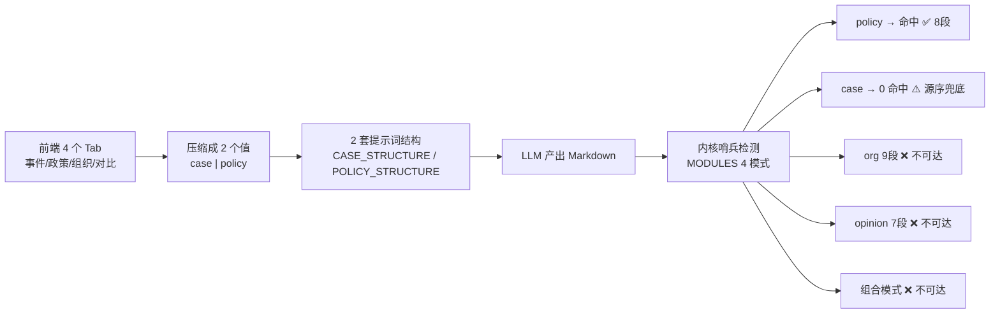

# 前端展示逻辑 ↔ 内核分析工作流 语义对齐分析

> 只读分析，未修改任何源文件。
> 内核路径：`三元结构理论 分析skill脚本程序/`
> 前端路径：`Web 分析模型/frontend/`
> 所有页面名 / 字段名 / 常量名逐字取自代码。

---

## 一、一句话结论

**部分脱钩，且脱钩发生在最要害的地方：方向反了。**

内核工作流是「**人写好一份成稿 Markdown → 引擎按章节哨兵自动识别报告类型 → 排版出 Word/PDF + 三态关系图**」；
前端呈现的是「**用户丢几个关键词/链接 → AI 生成一篇报告 → 展示一张力导向网络图**」。

前端的「项目 / 报告 / 网络图 / 素材」这套壳子基本能挂上内核的产物层（报告、DIAGRAM、Word/PDF 下载都对得上），
但**内核工作流真正的入口（成稿直排）、真正的分类机制（章节哨兵自动路由）、真正的图表语义（viz 三态）、真正的质量约束（13 条写作铁律 + 附录可点击来源）、真正的资产（`cases/` 13 个真实案例），在前端 UI 上一个都没有对应入口**。

一句话概括脱钩程度：**产物层对齐 ✅，输入层与分类层脱钩 ❌，图表语义层扭曲 ⚠️，质量铁律层完全缺席 ❌。**

---

## 二、内核工作流的本质（用大白话说清楚）

### 2.1 主链路

```mermaid
graph LR
  A["cases/run_XXX.py<br/>人写好的 BODY（成稿 Markdown）"] --> B["engine.CaseAnalysisEngine<br/>.export_from_text(title, body)"]
  B --> C["auto_number_headings()<br/>补中文章节序号"]
  C --> D["parser.parse_report()<br/>标题 → canonical id"]
  D --> E{"docx_renderer.MODULES<br/>哨兵命中判定"}
  E -->|命中 1 种| F1["按 canonical 序渲染<br/>政策8/事件5或8/组织9/舆情7"]
  E -->|命中 ≥2 种| F2["组合模式：按作者源序渲染"]
  E -->|0 命中| F3["源序全量渲染（兜底）"]
  F1 --> G["Word .docx"]
  F2 --> G
  F3 --> G
  G --> H["pdf_converter → .pdf"]
  D --> I["```DIAGRAM JSON<br/>viz=network/org/flow"]
  I --> J["viz_network.generate_diagram<br/>PNG 嵌 Word + 交互式 HTML"]
```

**关键点：引擎不接收 `analysis_type` 参数。** `export_from_text` 的签名只有
`(title, body, *, output_dir, slug, overwrite, tone)`——报告类型完全由正文写了哪些 `##` 章节标题决定。

### 2.2 四种报告类型与它们的「哨兵章节」

数据源：`parser._SECTION_IDS`（parser.py:71 起）+ `docx_renderer.MODULES`（docx_renderer.py:34 起）。

| 模式 key | 标签 | 哨兵章节（命中任一即路由） | 章节数 |
|---|---|---|---|
| `policy` | 政策 | `policy_portrait`（政策对象图谱）、`policy_weight`（政策权重与空间分析） | 8 段 |
| `event` | 事件/案例 | `case_portrait`（利益主体识别）、`case_flows`（利益动线与转化）、`case_dynamics`（制度与叙事作用） | 5 段 / 深度 8 段 |
| `org` | 组织 | `org_portrait`（组织画像）、`org_structure`（架构拆解与资金来源）、`org_survival`、`org_reproduction`、`org_interest_network`、`org_reverse`、`org_transformation` | 9 段 |
| `opinion` | 舆情 | `opinion_event`（事件与时间线）、`opinion_actors`（利益主体与沉默方）、`opinion_narrative`（叙事竞争矩阵）、`opinion_trilife`（三元生命维度）、`opinion_reverse`（逆反性质与层级）、`opinion_evolution`（演化曲线与系统回应） | 7 段 |
| **组合** | — | 同时命中 ≥2 种模式哨兵 | 按作者源序 |

共享章节（不带模式前缀、四种类型通用）：`fact_summary`（事实摘要）、`framework`（分析框架）、`analysis_body`（三元结构分析正文）、`conclusion`（结论/核心判断）、`appendix`（附录）。

`_detect_section_id()` 支持**模糊匹配**（标题包含关键词即命中），所以「独立事实摘要」也能命中 `fact_summary`；识别不了的标题降级为 slug，仍按源序渲染，不会丢段。

### 2.3 DIAGRAM 三态图（`viz_network.py`）

| `viz` 值 | 名称 | 布局 | 语义 |
|---|---|---|---|
| `network`（默认） | 利益关系网络图 | 力导向 spring_layout | 多主体复杂关系、无固定层级 |
| `org` | 组织架构图 | 自上而下 BFS 树形分层 | 控制链 / 股权 / 组织版图 |
| `flow` | 流程图 | 自左向右 BFS 分层 | 资金流转、决策链路、时序因果 |

节点 type（8 种，`theory_config.json.visualization.node_types` 与 `viz_network._NODE_COLORS` 一致）：
`material` / `security` / `political` / `identity_culture` / `institutional_future` / `public` / `actor` / `event`
边 type（4 种）：`economic` / `power` / `cultural` / `legal`

**一篇报告可以有多张图**：`cases/run_mixue_org.py` 与 `run_fang_xinghai_investigation_org_policy_opinion.py` 都内嵌 3 张 DIAGRAM（org + flow + network），由 `_render_section` 逐块渲染并交给 `diagram_collector`。

### 2.4 写作铁律（`AGENTS.md` 7 条 + `analysis_prompt.md`「写作铁律速查」13 条）

| # | 铁律 | 出处 |
|---|---|---|
| 1 | **案例先行** — 每节先讲具体事实，再引入概念 | 两处均有 |
| 2 | 禁止「事实层 / 概念层」分层标签 | 速查 2 |
| 3 | **概念限额 ≤ 3**（特殊 ≤ 4） | 两处均有 |
| 4 | **事实驱动** — 每句分析必须有具体事实支撑 | 两处均有 |
| 5 | 冲突式标题（拒绝「XX 分析」式学术标题） | 两处均有 |
| 6 | 可传播金句必写（结论最后 1-2 句） | 两处均有 |
| 7 | 价值中立（只描述机制，不做道德评价） | 两处均有 |
| 8 | 禁止万能套话（「由此可见」「综上所述」…） | 速查 8 |
| 9 | 段落不超 5 行 | 速查 9 |
| 10 | 概念首次出现用粗体 | 速查 10 |
| 11 | **数据来源可溯源** — 每条来源必须 `[名称](url)`，Word/PDF 中可点击 | AGENTS 规范 6 + 速查 11 |
| 12 | 六类利益闭环（主体 → 动线 → 制度叙事） | 速查 12 |
| 13 | 结论呼应框架 | 速查 13 |
| 附 | **反 AI 味符号约束**：全文 `——` ≤ 8 处；`**粗体**` 只用于概念首现与结论标签 | analysis_prompt.md:554 |
| 附 | **分析基调二选一**：`tone="neutral"`（客观中立，默认）/ `"provocative"`（煽动性） | engine.export_from_text 参数 |

### 2.5 `cases/` 是什么

`cases/` 下 13 个 `.py`（1 个模板 `run_report.py` + 12 个真实案例）。每个脚本的结构极其简单：

```python
TITLE = "方星海被查事件：任期政策取向与量化交易支持逻辑评估"
BODY = r"""
## 情况概述
...
## 事件与时间线
...
```DIAGRAM
{"viz":"flow","title":"...","nodes":[...],"edges":[...]}
```
...
"""
CaseAnalysisEngine().export_from_text(TITLE, BODY, overwrite=True)
```

**所以 `cases/` 不是「示例代码」，它是这个系统真正的资产库——12 篇已完成的成稿正文 + 已画好的关系图 JSON。**
AGENTS.md 明文规定：「任何报告必须先有 `cases/` 脚本再跑 engine，禁止临时脚本直出报告」。

---

## 三、前端页面逐一语义映射表

前端导航（`components/layout/Sidebar.tsx` 的 `NAV` 常量，7 项）+ 7 个 redirect 兼容页。

| 前端页面 / 路由 | 现在展示 / 让用户做什么 | 本应对应内核工作流哪一步 | 对齐 |
|---|---|---|---|
| `/dashboard`「工作台」 | 三个数字卡：项目总数 / 进行中任务 / 已完成报告；最近项目卡（`主体 N`、`利益项 N`、`章节 N`、完成度%）；最近活动、进行中列表 | 内核无「工作台」概念，属于 SaaS 壳层。可对应 `reports/` 目录的浏览 | ⚠️ 无害但空转：`subjects`/`interests`/`chapters` 三个指标在内核中没有对应真源 |
| `/projects`「项目」 | 项目卡网格，含 `status`（进行中/已完成）、`progress`（如 "68%"）、批量勾选删除 | **内核无「项目」概念**。内核的原子单位是「一份报告」= 一个 `cases/run_*.py` | ❌ 概念放大：见 §4.1 |
| `/projects/[id]`「项目详情」 | 四格统计（利益主体 / 利益项 / 报告章节 / 完成度）+ 本项目分析报告列表 + 快速操作（开始分析 / 查看报告 / 输入材料） | 若映射，应是「一个分析选题下的多篇报告」 | ⚠️ 统计口径与内核无对应；「报告章节」不区分 5/7/8/9 段 |
| `/analysis`「分析引擎」 | 4 个 Tab（`ANALYSIS_TABS`）+ **一个自由文本框** + 项目下拉 + 规则/AI 引擎切换 + 联网搜索勾选 + 「启动分析」；右侧 6 步进度链 | **内核工作流的入口**：应是「粘贴/编辑一份符合章节哨兵的成稿 Markdown → 调 `export_from_text`」 | ❌ 最严重脱钩：见 §4.2、§4.6 |
| — Tab「事件分析」 | → `analysis_type: "case"` | `event` 模式 5 段 / 深度 8 段 | ⚠️ 后端 `CASE_STRUCTURE` 只出 5 个共享章节，**不含 `case_portrait`/`case_flows`/`case_dynamics` 任何哨兵**，内核实际走「0 命中 → 源序兜底」，深度 8 段式不可达 |
| — Tab「政策分析」 | → `analysis_type: "policy"` | `policy` 模式 8 段 | ✅ 唯一真正对上的：`POLICY_STRUCTURE` 含「政策对象图谱」「政策权重与空间分析」两个哨兵 |
| — Tab「组织分析」 | → `analysis_type: "case"`（`ANALYSIS_TYPE = ["case","policy","case","case"]`） | `org` 模式 9 段 | ❌ **假 Tab**：点了等于事件分析，9 段组织诊断永远生不出来 |
| — Tab「对比分析」 | → `analysis_type: "case"` | 内核**无此模式** | ❌ 凭空多出来的概念 |
| — （缺失） | 无「舆情分析」入口 | `opinion` 模式 7 段 | ❌ 内核第 4 类报告在 UI 上完全不存在 |
| — （缺失） | 无「组合分析」入口 | 组合模式（源序渲染，`组合报告模式_L2设计.md`） | ❌ 内核最新能力无入口 |
| `/report`「报告库」 | 左侧任务列表（按 `title` + 状态色点），右侧一句提示 + 「打开完整展示页」按钮 | 对应 `reports/` 目录 | ✅ 基本对上 |
| `/report/[taskId]`「报告展示」 | 左：Markdown 全文渲染；右：**利益关系网络图**（`NetworkCanvas`）、**核心概念**（= DIAGRAM 前 10 个节点 label）、报告信息、下载 Word/PDF、手动调整、AI 重新生成、删除 | 对应 engine 的产物：Word + PDF + 交互式 HTML 关系图 | ⚠️ 图只渲染第一张且忽略 `viz`；「核心概念」把节点 label 当概念，与铁律 3「概念 ≤ 3」不是一回事 |
| `/report/[taskId]/edit` | `ReportEditor` 手工改 Markdown，存为 `revised` 版本 | 最接近内核「人写成稿」的地方 | ⚠️ 定位成「事后修订」而非「事前写作」，且无章节哨兵提示 |
| `/interest-analysis`「利益分析」 | 6 步只读视图：输入事件 / 识别主体（`type === "actor"` 节点）/ 利益配置 / 利益流动（边列表）/ 多视角（6 个静态 chip）/ 输出（4 个静态方块） | 对应内核 `case_portrait` 利益主体识别 + `case_flows` 利益动线 + `org_interest_network` | ⚠️ 数据是真的（从 DIAGRAM 解析），但「多视角」`VIEWS` 和「输出」`OUTPUTS` 是纯装饰，点不动 |
| `/materials`「输入材料」 | 粘贴文本 / 上传 `.txt .md .docx .pdf`；字段：标题、正文、**来源（自由文本）**、标签；列表 + 搜索 + 删除 | 对应内核「附录/数据溯源」的原始素材 + 铁律 11 来源可点击 | ❌ 见 §4.4：`source` 是自由文本，无 URL 要求；且**素材根本没传进分析** |
| `/settings`「设置」 | 通用设置：默认分析层级（`组织`/`事件`/`政策`，**无舆情**）、默认权重体系、默认分析深度、报告语言；AI 引擎：provider/key/model/temperature/prompt_version | 内核只有 `theory_config.json`（禁改）与 `tone` 二选一 | ❌ 「通用设置」四行按钮**全部没有 onClick、没有状态绑定**，是死 UI；内核真正的开关 `tone=neutral/provocative` 在前端毫无体现 |
| `/login` | token 存 `localStorage.tsap_token` | 内核无 | — |
| `/data` → `/materials` | redirect | — | ✅ 合并合理 |
| `/export` → `/report` | redirect | — | ✅ |
| `/impact` → `/report` | redirect | — | ✅ |
| `/network` → `/report` | redirect | — | ⚠️ 三态图被塞进报告页右侧 300px 侧栏，`org`/`flow` 无处安放 |
| `/multi-subject` → `/interest-analysis` | redirect | — | ✅ |
| `/project` → `/projects` | redirect | — | ✅ |
| `/wizard` → `/analysis` | redirect | — | ⚠️ 旧向导（`WIZARD_STEPS` 6 步：选择分析类型 → 设定分析目标 → 配置数据源 → 选择分析维度 → 生成与校验 → 导出报告）被砍掉，这 6 步其实**比现在的单输入框更接近内核工作流**，砍早了 |

### 3.1 前端 6 步进度链 vs 内核真实步骤

`lib/constants.ts` 的 `ANALYSIS_PHASES`：

| 前端步骤 | 内核对应 | 对齐 |
|---|---|---|
| 1 `inspect` 检查分析目标 | 无（内核假定输入已是成稿） | ⚠️ |
| 2 `search` 全网搜索相关信息 | 无（内核不联网） | ⚠️ 增量能力，可接受 |
| 3 `decompose` 对目标进行拆解分析 | 无（内核不做分析，分析是人做的） | ❌ 这一步替代了「人写稿」 |
| 4 `network` 利益关系网络拆解 | `viz_network.generate_diagram` | ⚠️ 只对应 `network` 一态 |
| 5 `organize` 整理分析结果 | `parser.parse_report` + `docx_renderer` 哨兵路由 | ⚠️ 内核最关键的「类型识别」在 UI 上完全不可见 |
| 6 `output` 输出分析结果 | `export_from_text` → Word + PDF | ✅ |

**用户在前端全程看不到「你这篇被识别成了政策/事件/组织/舆情报告」这条最关键的信息。**

---

## 四、核心脱钩点分析

### 4.1 「项目 project」 vs 内核「一份报告 / 一个 case」——概念被放大了一层

| 维度 | 内核 | 前端 |
|---|---|---|
| 原子单位 | 一份报告 = 一个 `cases/run_*.py`（TITLE + BODY）→ `reports/报告名_时间戳/` | 一个 `ProjectDTO`，其下挂 N 个 `TaskDTO` |
| 状态 | 无状态（跑完即产物） | `status`（进行中/已完成）、`progress`（"68%"） |
| 指标 | 无 | `subjects` 利益主体数、`interests` 利益项数、`chapters` 报告章节数 |

**问题**：内核里根本没有「一个项目下多篇报告」这层。前端凭空加了一层容器，然后被迫为这层容器编造三个统计指标（`subjects`/`interests`/`chapters`）和一个 `progress` 百分比——这四个数在内核中**没有权威定义**，只能由后端拍脑袋聚合。

**但这层加得不算错，只是错在挂错了东西**：真正该被「项目」承载的，是内核里现在没人管的东西——**同一选题下的成稿版本演进 + 该选题的素材池 + 该选题选定的报告类型**。现在前端的项目只承载了「一堆 task 的分组」，是个空壳。

**结论**：⚠️ 概念放大，但方向可救。见 §5.1。

---

### 4.2 「分析类型选择」 vs 内核「章节哨兵自动识别」——机制冲突（最严重）

内核 `AGENTS.md` 白纸黑字：「引擎**不接收 `analysis_type` 参数**」。

前端 `components/AnalysisEngine.tsx`：

```ts
const ANALYSIS_TABS = ["事件分析", "政策分析", "组织分析", "对比分析"];  // lib/constants.ts:120
const ANALYSIS_TYPE = ["case", "policy", "case", "case"] as const;      // AnalysisEngine.tsx:62
payload.analysis_type = ANALYSIS_TYPE[tab];
```

后端 `app/routers/analyze.py:22`：`analysis_type: str = "case"  # case | policy`
后端 `app/prompt_builder.py:85`：`structure = POLICY_STRUCTURE if analysis_type == "policy" else CASE_STRUCTURE`

于是形成一条**语义漏斗**：



具体证据：
- `CASE_STRUCTURE`（prompt_builder.py:60）只要求 5 个章节：`案例事实摘要` / `分析框架说明` / `三元结构分析正文` / `结论` / `附录`。这 5 个**全是共享章节**（`fact_summary`/`framework`/`analysis_body`/`conclusion`/`appendix`），一个 `event` 哨兵都没有 → `docx_renderer` 走「无哨兵命中 → 源序全量渲染」兜底分支。
- `POLICY_STRUCTURE`（prompt_builder.py:70）含 `## 政策对象图谱` 与 `## 政策权重与空间分析` → 命中 policy 哨兵 ✅。这是**唯一一条真正跑通内核类型路由的路径**。
- `app/contract.py:31` 的 `REQUIRED_SECTIONS` 也只有 `case` / `policy` 两套，没有 org / opinion。

**四种分析维度在 UI 里的体现情况**：

| 内核维度 | 前端 UI 是否有入口 | 实际是否可达 |
|---|---|---|
| 政策（8 段） | ✅ Tab「政策分析」 | ✅ |
| 事件/案例（5 段 / 深度 8 段） | ✅ Tab「事件分析」 | ⚠️ 只出 5 段共享结构，深度 8 段不可达 |
| 组织（9 段） | ⚠️ Tab「组织分析」（假的，映射到 case） | ❌ |
| 舆情（7 段） | ❌ 完全没有 | ❌ |
| 组合（源序） | ❌ 完全没有 | ❌ |
| 「对比分析」 | ✅ Tab | — 内核无此概念，凭空捏造 |

**冲突判定**：让用户选类型这件事**本身不冲突**——只要「选类型」的作用是「决定给用户什么写作骨架/哨兵章节模板」，而不是「传给引擎当参数」。现在的问题不是选了类型，而是：**选了 4 种却只实现 2 种，且选的结果没有翻译成对应的哨兵章节**。

---

### 4.3 「利益分析 / 网络图」 vs 内核 DIAGRAM 三态——只实现了一态，另两态被扭曲渲染

`lib/network.ts` 的类型定义已经暴露了问题：

```ts
export interface Diagram {
  viz: string; // "network"     ← 注释直接写死 network
  ...
}
export function parseDiagram(md?: string | null): Diagram | null {
  const m = md.match(/```DIAGRAM\s*([\s\S]*?)```/);   // 无 /g —— 只取第一张图
  ...
}
```

`components/NetworkCanvas.tsx` 从头到尾**没有读 `viz` 字段**，恒定使用力导向物理引擎：

```ts
physics: { enabled: true, stabilization: {...}, barnesHut: {...} }
shape: n.type === "actor" ? "hexagon" : "dot"
```

对照内核 `viz_network._generate_html`：`physics_default = "true" if viz == "network" else "false"`，`org` 用 `hierarchical` 垂直布局、`flow` 用水平布局。

| 问题 | 后果 |
|---|---|
| 只取第一张 DIAGRAM | `run_mixue_org.py` / `run_fang_xinghai_*.py` 这类含 3 张图（org + flow + network）的报告，前端**只显示第一张，另两张静默丢失** |
| 忽略 `viz` 字段 | 一张本该「自上而下层级」的组织架构图，被力导向弹成一团散点——**层级语义（谁管谁）与时序语义（钱怎么流）被物理引擎抹平** |
| 只有一个 300px 侧栏容器 | 就算解析出多图也没地方放；`/network` 路由已被 redirect 掉 |

**节点类型映射还有实打实的 bug**（`lib/network.ts:45` `INTEREST_TYPE_COLOR`）：

| `theory_config.json` 定义的 type | 前端 `INTEREST_TYPE_COLOR` key | 结果 |
|---|---|---|
| `material` | `material` | ✅ |
| `security` | `security`（另有多余的 `safety`） | ✅ |
| `political` | `political` | ✅ |
| **`identity_culture`** | **`identity`** | ❌ 不匹配 → 落 `#9CA3AF` 灰色，标签显示原始英文串 |
| `institutional_future` | `institutional_future` | ✅ |
| `public` | `public` | ✅ |
| `actor` | `actor` | ✅ |
| **`event`** | **（缺失）** | ❌ 灰色 + 英文标签 |

即：**「身份文化利益」这一类利益，在前端网络图上永远是灰色的、名字是 `identity_culture`。** 而 `contract.VALID_NODE_TYPES` 和 `prompt_builder` 注入给 LLM 的 type 取值都是 `identity_culture`，所以这个错会稳定复现。

---

### 4.4 「输入材料 materials」 vs 内核铁律 11「附录来源 `[名称](url)` 可点击」——完全没落地，且素材根本没进分析

两个独立问题：

**(a) 来源格式毫无约束。** `MaterialMeta.source` 是 `string | null`，UI placeholder 写的是「来源（可选，如：公告链接 / 文号 / 出处说明）」——「可选」「文号」「出处说明」三个词，恰好把内核铁律 11 明令禁止的写法（「无链接的媒体名」「模糊来源」）当成了推荐用法。内核 `analysis_prompt.md:276` 的强制规范是：

> 格式必须为 `[来源完整名称](https://完整URL)`，引擎据此渲染为 Word/PDF 可点击超链接
> 禁止写法：裸露的纯文字 URL、模糊来源（如"综合网络信息""来源：全国人大网"而无链接）、无链接的媒体名

前端**没有任何一处**提示、校验或引导这个格式。

**(b) 素材压根没传给分析。** `lib/api.ts:14` 定义了 `material_ids?: string[]`（注释「本次分析使用的材料（证据出处）」），但全前端搜索 `material_ids`：

```
lib/api.ts:14:  material_ids?: string[];     ← 只有定义
```

`AnalysisEngine.tsx` 组装 payload 时只放了 `title` / `input_text` / `analysis_type` / `mode` / `llm_config` / `project_id` / `search`，**从来没设过 `material_ids`**。

所以「输入材料」页现在的真实作用是：**一个跟分析流程完全断开的文件收纳箱**。分析引擎右侧那张「材料来源」卡片只是显示一句统计文案「已入库 N 份材料」，并配了句误导性说明「分析时可在向导中作为证据引用」——而向导（`/wizard`）已经被 redirect 掉了。

---

### 4.5 「案例 / 模板」 vs `cases/` 13 个真实案例——前端零引用

全前端搜索 `案例库` / `cases` / `模板`：**0 命中**。

| 内核有 | 前端有 | |
|---|---|---|
| `cases/run_report.py` 空白模板 | 无 | ❌ |
| 12 篇真实成稿（政策 4 篇 / 事件 4 篇 / 组织 2 篇 / 舆情 1 篇 / 组合 1 篇） | 无 | ❌ |
| 每篇都自带写好的 DIAGRAM JSON | 无 | ❌ |
| AGENTS.md 里的案例清单表 | 无 | ❌ |

这是**最可惜的一处**：系统里最有价值的东西（12 篇已验证的、符合全部铁律的成稿）在前端不存在。新用户打开「分析引擎」看到的是一个空文本框和一句「输入关键词、事件描述或网络链接…」——他不可能知道一份合格的三元结构报告长什么样。

---

### 4.6 写作铁律在前端输入引导中的体现——0/13

逐条核对前端输入区（`AnalysisEngine.tsx` 的 textarea + hint + placeholder）：

| 铁律 | 前端是否有引导/提示/校验 |
|---|---|
| 案例先行 | ❌ |
| 概念 ≤ 3 | ❌（`/report/[taskId]` 右栏「核心概念」还一次列出 10 个 DIAGRAM 节点 label，方向相反） |
| 事实驱动 | ❌ |
| 冲突式标题 | ❌ |
| 可传播金句 | ❌ |
| 价值中立 | ❌ |
| 禁止万能套话 | ❌ |
| 段落 ≤ 5 行 | ❌ |
| 概念首现加粗 | ❌ |
| 附录来源 `[名称](url)` | ❌（见 §4.4） |
| 六类利益闭环 | ❌ |
| 结论呼应框架 | ❌ |
| 反 AI 味符号约束（`——` ≤ 8） | ❌ |
| `tone` 客观中立 / 煽动性 | ❌ 前端无此开关 |
| 「情况概述」作第一章 | ❌（该写法目前只见于 `run_fang_xinghai_*.py` 一例，且 `_SECTION_IDS` 中无此键，走 slug 兜底；**内核自身也未把它规范化**，不算前端漏做） |

前端唯一的输入引导是两句话：

- placeholder：`"输入关键词、事件描述或网络链接…"`
- hint：`"支持关键词、事件/政策描述、网络链接。系统会自动识别分析对象。"`

**这两句话把整套工作流的定位彻底改写了**：内核说「你写好一份符合章节结构的成稿，我帮你排版」；前端说「你丢个关键词，我帮你写」。这不是同一件事。

> 附带证据：`AnalysisEngine.tsx:576` 有一条自嘲式提示——「规则引擎基于结构化输入（主体/利益/证据），当前为自由文本只会生成占位骨架；建议切到『AI 增强』获得真实分析」。这句话等于承认：**不接 LLM，这个前端产不出任何真东西**。而内核 `cases/` 的 12 篇报告，一行 LLM 都没用过。

---

### 4.7 汇总：脱钩点严重度排序

| # | 脱钩点 | 严重度 | 一句话 |
|---|---|---|---|
| 1 | 内核入口「成稿 Markdown 直排」在前端无入口 | 🔴 致命 | 工作流本质被改写成「AI 代写」 |
| 2 | 4 种报告类型只有 2 种可达，舆情/组织/组合完全不可达 | 🔴 致命 | UI 上「组织分析」Tab 是假的 |
| 3 | DIAGRAM 只取第一张、忽略 `viz` 三态 | 🟠 高 | org/flow 图被力导向抹平语义 |
| 4 | 13 条写作铁律 0 条进入输入引导 | 🟠 高 | 产出质量无从保证 |
| 5 | `material_ids` 定义了但从不传 → 素材与分析断开 | 🟠 高 | 「输入材料」页是死胡同 |
| 6 | `cases/` 12 篇真实案例前端零引用 | 🟡 中 | 最有价值资产被埋没 |
| 7 | `identity_culture` / `event` 节点类型映射缺失 | 🟡 中 | 身份文化利益永远显示灰色 |
| 8 | `project` 概念放大且指标无真源 | 🟡 中 | 空壳容器 |
| 9 | 设置页「通用设置」四行是死 UI，`tone` 开关缺席 | 🟢 低 | 装饰性代码 |

---

## 五、对齐建议（只描述改什么，不给代码）

### 5.1 建议一：把「分析引擎」页从「关键词框」改成「成稿工作台」（双入口）

页面顶部提供两个明确入口，让用户先声明自己处在哪一步：

| 入口 | 面向 | 行为 |
|---|---|---|
| **A. 我已写好成稿** | 内核原生工作流（对应 `cases/run_*.py` 的 BODY） | 大编辑器粘贴/编辑 Markdown → **直接调 `export_from_text`**，不经 LLM、不经 `analysis_type`。右侧实时显示「已识别章节」与「判定报告类型」 |
| **B. 帮我起草** | 现在的 AI 路径 | 关键词/素材 → LLM 起草 → **产物落回入口 A 的编辑器**，由人改到合格再排版 |

关键：**B 的终点必须是 A 的起点**，不能像现在这样 B 直接出终稿。这一改，前端就从「另一个东西」变回「内核工作流的界面」。

### 5.2 建议二：把「选类型」翻译成「选章节骨架」，并补齐 4 + 1 种

- Tab 改为 5 项：**政策分析（8 段）/ 事件分析（5 段·深度 8 段）/ 组织诊断（9 段）/ 舆情分析（7 段）/ 组合分析**，删掉内核不存在的「对比分析」。
- 选中某类型后，**编辑器自动插入该类型的哨兵章节骨架**（章节标题逐字取自 `parser._SECTION_IDS`，如组织诊断插入「组织画像 / 架构拆解与资金来源 / 生存诊断 / 繁衍诊断 / 利益关系网络与利益集团拆解 / 逆反诊断 / 利益转化与组织—社会关系 / 诊断结论 / 附录」）。
- 「组合分析」允许勾选多个模式，按勾选顺序拼骨架（对应内核源序渲染）。
- 编辑器侧栏常驻一个**「当前判定：组织诊断（9 段）· 已命中哨兵 org_portrait, org_structure…」**的实时徽标——把内核最关键、现在完全不可见的哨兵路由机制**显性化**。用户就能亲眼看到「我写了什么标题 → 系统认成什么报告」。
- 后端相应把 `analysis_type` 的取值域从 `case|policy` 扩到 `policy|event|org|opinion|combo`，`prompt_builder` 与 `contract.REQUIRED_SECTIONS` 各补两套结构。

### 5.3 建议三：DIAGRAM 按三态渲染，且支持一篇多图

- `parseDiagram` 改为提取**全部** DIAGRAM 块（正则加 `/g`），返回数组。
- `NetworkCanvas` 读 `viz` 字段分流：`network` → 力导向（现状）；`org` → vis-network `hierarchical` 垂直层级、关物理；`flow` → `hierarchical` 水平方向、关物理。这与内核 `viz_network._generate_html` 的行为一一对应。
- 报告展示页把关系图从 300px 侧栏提到**独立标签页/全屏抽屉**，多图时用「图 1 组织架构图 / 图 2 资金流程图 / 图 3 利益关系网络」切换（沿用内核为每张图写的 `title`）。
- 修掉类型映射：`identity` → `identity_culture`，补 `event`；直接以 `theory_config.json.visualization.node_types` 为唯一真源，避免再漂。
- 恢复 `/network` 为独立页面（现在被 redirect 到 `/report`），承载全屏三态图 + 图例。

### 5.4 建议四：把 13 条写作铁律做成编辑器的实时检查清单

在成稿编辑器右侧放一个**「铁律自检」面板**，逐条对应 `analysis_prompt.md` 的「生成后自检项」+「写作铁律速查」，可机检的直接算，不可机检的做勾选提醒：

| 可机检（自动算） | 提醒式（人工勾） |
|---|---|
| 章节是否齐全且顺序正确（比对 `MODULES[mode].sections`） | 案例先行 |
| DIAGRAM 是否存在 / JSON 是否合法 / 节点是否都带 `type` | 事实驱动 |
| 附录每条来源是否为 `[名称](url)` 格式 | 冲突式标题 |
| 全文 `——` 计数是否 ≤ 8 | 可传播金句 |
| 是否有连续 > 5 行的纯文字段落 | 价值中立 |
| 万能套话黑名单命中（「由此可见」「综上所述」…） | 结论呼应框架 |
| 加粗概念数量是否 ≤ 3 | 六类利益闭环 |

这一条能直接把内核质量标准搬到 UI 上，是**投入产出比最高的一项**。

### 5.5 建议五：让「输入材料」真正进入分析，并强制来源可点击

- `materials` 的 `source` 字段拆成 **`source_name`（来源完整名称）+ `source_url`（URL）** 两个字段，保存时校验 URL 形态；列表页把它渲染成可点击链接。
- 分析提交时真正带上 `material_ids`（这个字段已经定义好了，只差前端传）。
- 成稿编辑器提供「**插入附录来源**」按钮：从本项目已关联素材里勾选，一键生成符合铁律 11 的 `1. [来源完整名称](https://…)` 列表，直接写进 `## 附录`。
- 这样「素材 → 附录可点击来源 → Word/PDF 超链接」这条内核链路才算在前端闭环。

### 5.6 建议六：把 `cases/` 12 篇案例做成前端「案例库」

- 新增导航项「案例库」，列出 `cases/` 下全部脚本，展示字段直接取自 `AGENTS.md` 的案例清单表：脚本文件 / 案例名称 / 创建时间 / 报告类型（政策8段·事件5段·组织9段·舆情7段·组合）。
- 每条支持三个动作：**预览成稿正文**（渲染 BODY）、**看关系图**（渲染其 DIAGRAM，三态各归其位）、**以此为模板新建**（把 BODY 的章节骨架 + DIAGRAM 结构复制进新成稿编辑器，正文清空）。
- 这一条同时解决了「新用户不知道合格报告长什么样」和「§5.2 骨架从哪来」两个问题。

### 5.7 建议七（顺手）：补 `tone` 开关，砍掉死 UI

- 成稿提交时暴露内核真实存在的 `tone` 开关：**客观中立 / 煽动性**（`engine.export_from_text(tone=...)`），并在 UI 上说明「只影响封面标注与行文取向，不改变报告结构」。
- 设置页「通用设置」的「默认分析层级 / 默认权重体系 / 默认分析深度」三行按钮既无 onClick 也无内核对应物，建议改为：**默认报告类型**（政策/事件/组织/舆情）+ **默认基调**（neutral/provocative）+ **默认引擎模式**（rule/llm），全部绑到已有的 `AppConfig`。

---

## 六、需要用户拍板的三个问题

### 问题 1：概念模型——「项目」这层要不要保留？要保留的话它承载什么？

三个选项：

| 选项 | 含义 | 代价 |
|---|---|---|
| **A. 砍掉项目层** | 回归内核原子单位：一份报告 = 一个条目，导航只剩「报告库 / 案例库 / 素材 / 分析」 | 概念最干净，与内核 1:1；但已有 `ProjectDTO`、`/projects`、`/projects/[id]` 三处要下线 |
| **B. 保留但重新定义**（推荐） | 项目 = **一个分析选题**，承载：该选题的素材池 + 成稿版本演进 + 选定的报告类型 + 最终产物。`subjects`/`interests`/`chapters` 改为从该选题终稿的 DIAGRAM 与章节真实统计 | 改动中等，语义变实 |
| **C. 维持现状** | 项目 = 一堆 task 的分组 | 四个统计指标继续没有真源，长期是技术债 |

### 问题 2：分析类型机制——「用户选」还是「系统认」，还是两者结合？

| 选项 | 机制 | 说明 |
|---|---|---|
| **A. 纯自动**（内核原教旨） | UI 不给选，用户写什么章节就是什么类型 | 与内核完全一致，但对新用户极不友好——他不知道该写哪些章节 |
| **B. 选类型 = 选骨架**（推荐） | 用户选类型 → 系统插入对应哨兵章节骨架 → 引擎仍靠哨兵自动识别 | 用户体验好，且**不违背内核「不传 analysis_type」的设计**：类型只影响给人的模板，不影响引擎 |
| **C. 维持现状** | 选类型 → 传给后端 → 决定 LLM 提示词 | 与内核机制并行两套分类逻辑，长期会漂 |

如果选 B，还需要确认：**「对比分析」这个 Tab 是砍掉，还是要在内核里真的新增一种模式？**（内核目前无对应，新增需同步改 `parser._SECTION_IDS` + `docx_renderer.MODULES` + `analysis_prompt.md` 三处。）

### 问题 3：`cases/` 12 篇案例要不要进前端？以什么身份进？

| 选项 | 说明 | 顾虑 |
|---|---|---|
| **A. 只读展示** | 案例库页面，能看正文和关系图，不能改 | 最安全 |
| **B. 只读 + 一键套模板**（推荐） | 额外支持「以此为模板新建」，复制章节骨架与 DIAGRAM 结构、清空正文 | 需要定义「骨架」的抽取规则 |
| **C. 可编辑** | 前端能直接改 `cases/*.py` | ❌ 不建议：违反 AGENTS.md「脚本为一次性产物，用完即弃」，且会把前端变成代码编辑器 |

附带需确认：**案例正文里含真实人名与在办案件（如方星海被查事件），前端如果有多用户/对外访问，是否需要访问控制或脱敏？**

---

*本文档为只读语义分析，未修改任何源文件。所有页面名、字段名、常量名、行号均取自 2026-07-27 时点的代码实况。*
