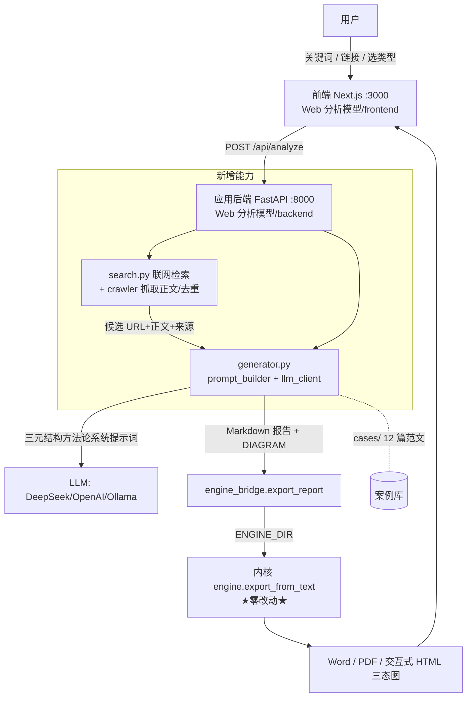
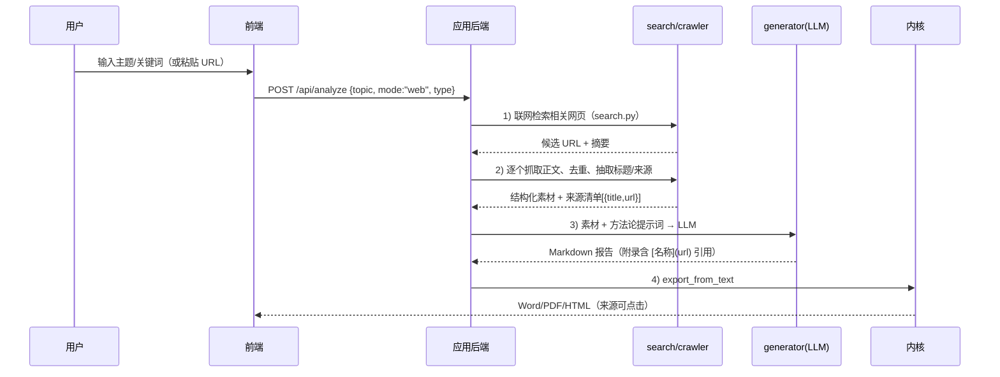

# 三元结构理论 SaaS — 实施方案（前端对齐工作流 + 自动联网抓取写报告）

> **文档性质**：PRD + 架构设计合并实施方案。
> **标注**：本应由「产品经理(许清楚)→架构师(高见远)」两段产出；当前 Agent 派发平台侧故障（`Failed to execute task: Cannot read properties of undefined (reading 'history')`），由主理人齐活林依据既有分析文档与代码实读**代拟**，待平台恢复可再交由对应成员复核。
> **日期**：2026-07-31
> **基于的正确前提**：用户真实工作流 = **AI 写、内核排**。用户丢关键词/链接 → AI 智能体读三元结构理论方法论 → 自动写完整报告+利益关系网络 → 内核渲染 Word/PDF/HTML。

---

## 0. 总体方案（一句话）

把「应用仓库 Web 分析模型」的现有前端+后端，从「只能 AI 写 2 种报告、图被压扁、无联网」升级为「**5 种报告类型全通 + 一键联网抓取素材并写报告 + 三态图正确呈现 + 报告展览页（可下载/可编辑/修改留痕）+ 铁律引导**」的本地优先 SaaS；内核仓库**零改动**，仅黑盒调用 `export_from_text`。

---

## 1. 架构拓扑（现状 → 目标）

**关键不变量**：内核仓库 `engine/parser/docx_renderer/viz_network` **一个字不动**；应用层通过 `engine_bridge.export_report` 黑盒调用。KERNEL 仓库里那个 `backend/`（1347 行孤儿）标记**冻结/忽略**，所有改动在 APP 仓库做。

---

## 2. 目标 B：自动联网抓取 + 写报告（核心新需求）

### 2.1 期望流程

### 2.2 改动点（均在 APP 后端）
- **`search.py`（已存在，扩展）**：从"返回检索结果"升级为"检索 + 抓取 + 清洗"一体化。**检索源策略**：默认走 **DuckDuckGo HTML/lite 端点**（零 Key、免费、抓公开结果）；若配置了 `BING_SEARCH_KEY`/`BRAVE_SEARCH_KEY` 环境变量则自动切换为对应 API（更稳、覆盖更广）。抓取用 `requests`/`httpx` + `readability-lxml`/`trafilatura` 抽主文，按标题/正文相似度去重，输出 `{title, url, text, snippet}`。
- **新增 `materials.py`**（~120 行）：把抓取结果组装成 generator 的 `materials` 字段；维护来源清单供前端回显与"附录可点击"强制校验。
- **`generator.py` 改造**：`_build_user_prompt` 已支持 `input_text`；新增 `web_mode` 分支——把抓取素材拼进提示词，并强制系统提示要求"每个事实引用一条 `[名称](url)` 来源"。
- **前端 `AnalysisEngine` 改版**：输入区增加「联网检索」开关（默认开）、检索结果预览列表（可勾选/剔除来源）、进度条（已有 WebSocket 进度通道可复用）。

### 2.3 验收标准
- 给定任一热点主题，系统能返回 ≥3 条真实可打开的来源，并写入报告附录为可点击链接。
- 用户粘贴单篇 URL 时，系统抓取该页正文作为素材写报告（"丢链接自动抓内容写报告"）。

---

## 3. 目标 A：前端对齐工作流

### 3.1 报告类型全通（P0）
- **`prompt_builder.py`（扩展）**：现有 `case`/`policy` 两套，新增 `org`（组织9段）、`opinion`（舆情7段）、`combo`（组合）。每套 = 对应方法论系统提示词 + 章节骨架。
- **`generator.py`**：`analysis_type` 参数已是字符串，放开到 5 值即可。
- **前端类型选择**：4 个 Tab（事件/政策/组织/对比）映射到 `case/policy/org/combo`；**新增「舆情」第 5 个 Tab** 映射到 `opinion`。杜绝"组织 Tab 实际走事件"的假映射。
  > **双轨护栏（用户决策 #3 = 维持双轨）**：前端所选 `type` 传入 `generator` 决定 LLM 提示词；内核仍按章节标题自动路由。两者必须一致——架构师需确保 `prompt_builder` 每套提示词强制产出与所选类型匹配的章节标题（如 org 必含 `org_portrait/org_structure/...`），否则内核会误判成其他类型、渲染错位。这是双轨方案下唯一需主动防护的点。

### 3.2 三态图正确渲染（P0）
- **前端 `parseDiagram`**：正则加 `/g`，抓取**全部** DIAGRAM 块（一篇可多图）。
- **`NetworkCanvas`**：读取每个 DIAGRAM 的 `viz` 字段 → 分流 `network`(力导向)/`org`(层级树)/`flow`(左→右流程) 三种布局；补 `identity_culture`/`event` 节点类型的颜色映射（修复灰+英文标签 bug）。
- 报告页提供「三态图查看器」Tab，分别展示。

### 3.3 写作铁律 + 报告展览页 + 案例库（P1）
- **铁律自检面板**：把 13 条写作铁律做成静态 JSON，编辑器右侧实时清单（如"是否先讲案例""概念是否≤3""附录来源是否可点击"）。投入产出比最高的一条。
- **报告展览页（核心体验，P1）**：每篇 AI 写好的报告，进入一个**专门、好看的前端页面**展示——Word/PDF 下载按钮 + 三态图查看器 + 章节正文阅读视图。这是用户最在意的"成果展示"出口。
- **报告可编辑 + 修改留痕（P1）**：在展览页提供「手动改」与「让 AI 再改一版」两种入口。
  - **手动改**：前端 Markdown 编辑器直接改，保存后生成新版本。
  - **自动改**：用户描述修改意图（如"把第三章改写得更尖锐"）→ 调 `generator` 的 revise 模式（基于上一版 + 指令再生）。
  - **版本标记**：每一次修改都记录**时间戳 + 改动摘要 + 谁改的（人/AI）**，展览页提供版本时间线，可回看/回滚到任一版本。内核 `export_from_text` 对每个版本重渲 Word/PDF。
  > 注：用户明确 —— cases/ 12 篇**不是**"已验证不可改范文"，可以在前端编辑；上述编辑/版本能力对 AI 生成的报告与 cases 范文一视同仁。

### 3.4 顺手修的真缺口
- **`GET /api/tasks`**：前端 5 个页面调用、APP 后端当前零实现 → 列表空白。需补（~30 行，返回 runs 列表）。

---

## 4. 任务拆解清单（有序、含文件/仓库/依赖）

| # | 任务 | 文件（仓库） | 改动量 | 依赖 | 优先级 |
|---|---|---|---|---|---|
| T0 | 跑 `start.bat` 验证现状，记录 case/policy 实际产出 + /api/tasks 缺失现象 | —（手动） | 0.5h | — | P0 |
| T1 | `search.py` 升级：检索+抓取+清洗+去重 | Web 分析模型/backend/app/search.py | ~150 | — | P0 |
| T2 | 新增 `materials.py`：素材组装+来源清单 | Web 分析模型/backend/app/materials.py | ~120 | T1 | P0 |
| T3 | `generator.py` 加 `web_mode`：素材注入+强制引用 | Web 分析模型/backend/app/generator.py | ~60 | T1,T2 | P0 |
| T4 | `prompt_builder.py` 补 org/opinion/combo 三套提示词 | Web 分析模型/backend/app/prompt_builder.py | ~200 | — | P0 |
| T5 | 前端类型选择补「舆情」Tab，5 类型真映射 | Web 分析模型/frontend/app/**/page.tsx + api.ts | ~80 | T4 | P0 |
| T6 | 前端 `parseDiagram` 加 /g + `NetworkCanvas` 按 viz 三态渲染 + 节点配色 | Web 分析模型/frontend/lib/network.ts + components/NetworkCanvas.tsx | ~120 | — | P0 |
| T7 | 补 `GET /api/tasks` | Web 分析模型/backend/app/routers/*.py | ~30 | — | P0 |
| T8 | 前端分析页改版：联网开关+来源预览+进度 | Web 分析模型/frontend/components/AnalysisEngine.tsx | ~150 | T3,T7 | P1 |
| T9 | 铁律自检面板（静态 JSON） | Web 分析模型/frontend/components/* + lib/rules.json | ~100 | — | P1 |
| T10 | 报告展览页：展示 + Word/PDF 下载 + 三态图查看器 | Web 分析模型/frontend/app/report/[id] | ~200 | T6,T7 | P1 |
| T11 | `start.bat`/部署脚本核对（127.0.0.1 绑定、CORS） | Web 分析模型/start.bat + settings.py | ~30 | — | P1 |
| T12 | 联调 + e2e（跑 5 类型 + 联网主题） | tests/ | ~120 | T1–T10 | P0（收尾） |
| T13 | 报告编辑 + 版本管理：手动改/AI 改 + 时间戳与改动留痕 + 版本时间线 | backend/routers/revisions.py + frontend 展览页编辑入口 + SQLite revisions 表 | ~250 | T10 | P1 |
| T14 | cases 案例库（可编辑）：`GET /api/cases` + 前端案例库页 + 套用/编辑 | backend/routers + frontend/app/cases | ~150 | T13 | P1 |

**依赖图**：T1→T2→T3（联网写报告链）；T4→T5（类型全通链）；T6 独立；T8 依赖 T3+T7；T10 展览页依赖 T6+T7；T13 编辑/版本依赖 T10；T14 案例库依赖 T13；T12 收尾全量。

---

## 5. 部署（本地优先 SaaS）

- **现状**：`Web 分析模型/start.bat` 已能一键拉起前后端；`settings.py` CORS 已放行 `127.0.0.1:3000`；`ENGINE_DIR` 默认指 KERNEL。
- **交付形态**：双击 `start.bat` → 后端 :8000 + 前端 :3000，全程绑 `127.0.0.1`，数据全本机（SQLite + reports/）。
- **需确认**：是否要常驻为 Windows 服务（开机自启），还是保持"双击即用、关窗口即停"。

---

## 6. 用户决策记录（2026-07-31 已拍板）

| # | 决策项 | 用户选择 | 备注 |
|---|---|---|---|
| 1 | 联网抓取源 | **直连搜索引擎**，优先零成本/零 Key 方案（DuckDuckGo HTML 抓取）；可选升级为 Bing/Brave 等需 Key 的搜索 API | 用户希望"更方便且无成本"；默认走 DDG 免费源，有 Key 再升级 |
| 2 | 登录态/反爬抓取 | **不搞**，只抓公开内容 | 范围限定为公开网页，降低合规风险 |
| 3 | 报告类型选择机制 | **维持现状双轨**（前端选类型 → 后端决定 LLM 提示词；内核仍按标题自动路由） | ⚠️ 设计注意：需确保 LLM 按所选类型产出的章节标题，与用户所选类型一致，避免内核渲染与预期不符。**工作流本质**：用户只给大概内容/链接，程序从头到尾自动写完整报告（AI 写、内核排），用户不手写成稿——双轨不改变"全自动写"这一前提 |
| 4 | cases 案例 / 报告编辑 | **可在前端编辑**，且新增「报告展览页 + 修改留痕」 | ✅ 纠正此前误判：用户从未规定"cases 不可改"；真实需求=报告生成后有专门好看页面展览+下载+可改+改了标时间戳 |
| 5 | 部署形态 | **维持双击 `start.bat` 启动** | 本地优先、绑 127.0.0.1、关窗口即停 |

**决策带来的方案变更**：
- 目标 B 联网写报告：检索源 = 直连搜索引擎，**优先 DuckDuckGo 免费 HTML 源（零 Key）**，有 Key 再升级 Bing/Brave；抓取范围 = 仅公开内容。
- 目标 A：报告展览页 + 编辑/版本留痕 提升为正式 P1 功能（T10/T13）；cases 可编辑（T14）。
- 双轨（#3）保留现状，架构师在设计时需加"类型一致性"护栏（见 §3.1 注）。

---

## 7. 实施节奏建议

- **Phase 0（0.5h）**：跑 `start.bat` 验证，锁定现状基线（尤其 /api/tasks 缺失、类型假映射）。
- **Phase 1（目标 B，~1.5d）**：T1–T3 + T8 → 实现"丢关键词/链接 → 自动联网抓素材 → 写报告"。这是你最在意的新能力。
- **Phase 2（目标 A 类型+图，~2d）**：T4–T7 → 5 类型全通 + 三态图正确。
- **Phase 3（体验，~1.5d）**：T9–T11 → 铁律面板 + 案例库 + 部署核对。
- **Phase 4（~1d）**：T12 全量联调 + e2e。

> 注：内核 R3/R6（静默丢章节）属内核仓库，按红线本次**不动**；若联调发现生成的报告丢章节，再单独立项修（不影响前端对齐与联网写报告两条主线）。
